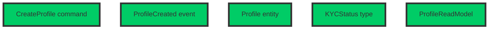
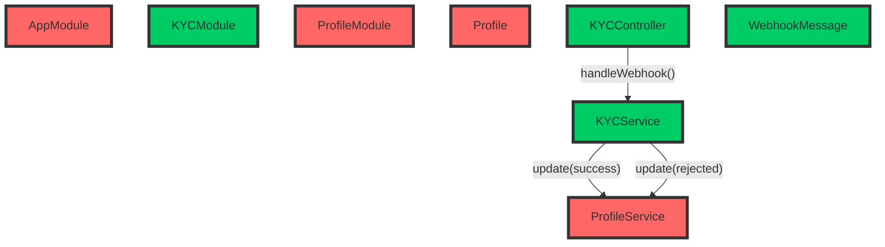
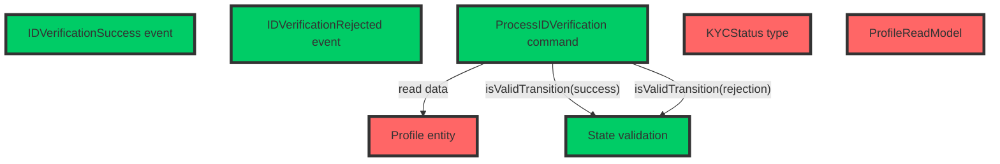
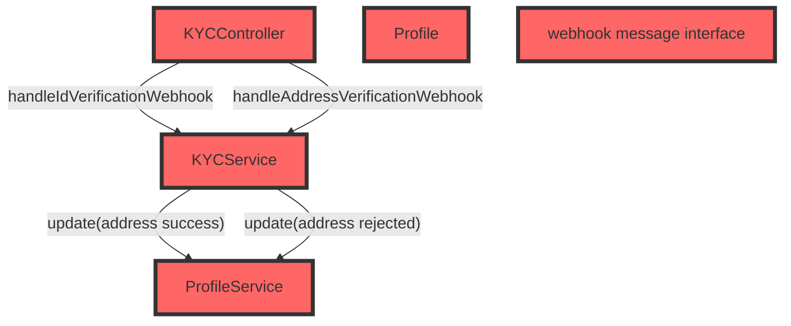
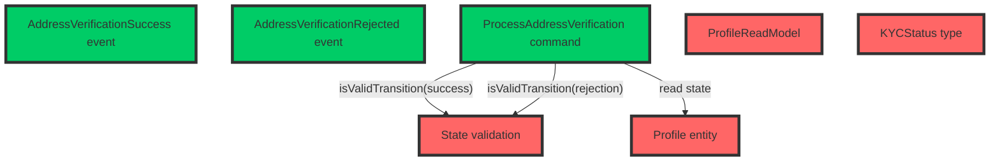
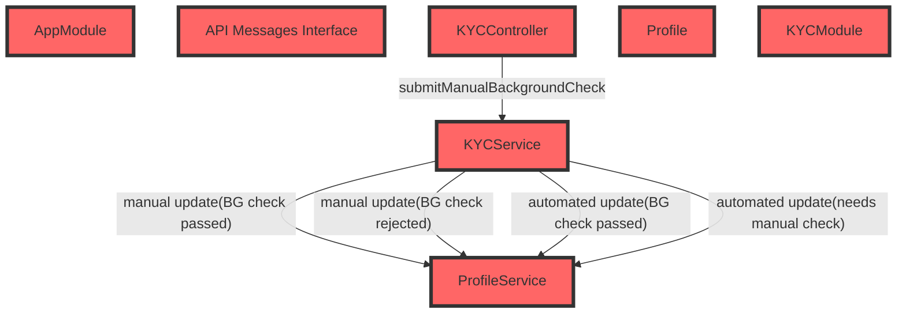
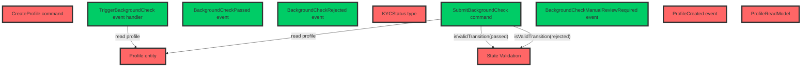
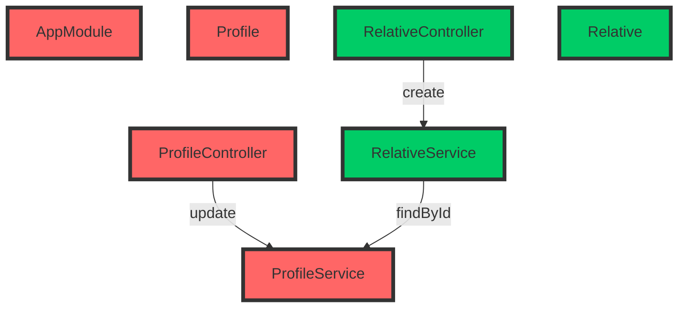
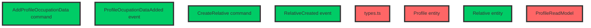

# Comparing complexity in MVC+CRUD vs. CQRS+ES

## Introduction

In software development projects, requirements are often described as user stories, which explain user intents and expectations (As `<someone>`, I want `<something>` because `<reason>`). Still, most backend systems nowadays are designed after the [Model-View-Controller (MVC)](https://en.wikipedia.org/wiki/Model–view–controller) design pattern, that describes software around the concept of Models (the M in MVC) that can be **C**reated, **R**ead, **U**pdated or **D**eleted (CRUD), handled by controllers and represented with views. This makes product and engineering teams speak slightly different languages that need a certain translation effort. Well-known frameworks like [Spring Boot](https://spring.io/projects/spring-boot) or [Ruby on Rails](https://rubyonrails.org) are good representatives of MVC/CRUD frameworks.

[Domain-Driven Design (DDD)](https://en.wikipedia.org/wiki/Domain-driven_design) aims to narrow this communication gap by using design patterns that are closer to the way humans and business stakeholders discuss the processes in their organizations. In DDD projects is frequent to use design patterns like [CQRS](https://www.martinfowler.com/bliki/CQRS.html) and [Event-Sourcing](https://martinfowler.com/eaaDev/EventSourcing.html). Each user intent is 1:1 represented in code as a `Command`, everything that happens is expressed as `Events` (records of facts), and the state can be aggregated and consumed as `Read Models`.

### Compound complexity

As a software system scales, and subsequently the team behind of it grows, it's easy to start noticing how changes become more and more costly as time passes. It becomes harder for engineers to fully understand the codebase, and coupling between different parts of it makes that even the slightest change requires major code updates, even in unexpected files, making it harder to estimate the cost of a new feature beforehand.

One of the most compelling arguments of [Event Modeling](https://eventmodeling.org), a reference methodology to describe and design DDD and event-driven systems, is that software that follows CQRS+Event Sourcing patterns keep the coupling low enough to flatten the complexity curve. In traditional MVC+CRUD systems that are designed as a stateful resource store (models), it's common to find use cases that need to operate with more than one model at the same time. These relationships have to be handled at every layer, building a network of relationships over time that never stops growing.

Every new connection added to the system, has a multiplicative effect in complexity, generating an effect that is very similar to compound interest. While the size of every individual change seems negligible, these changes compound with each other and end up growing exponentially, but this is so gradual that it's hard to notice until everyone in the team start thinking that it may be worth a full rewrite (almost never is).

### Does CQRS+ES actually solve this?

Intuitively, we perceive that we need less relationships between different parts of the codebase when implementing a CQRS+ES system. Command handlers are all self-contained, they can access the data, but they do not operate directly on data, they use it to make decisions, and the decisions do not alter the data directly, but are expressed as events, which again, are just data. The same happens with event handlers. Command and event handlers are stateless, and operate on data exclusively.

But we want to go beyond intuition and illustrate this with data. In this repository we have implemented the same application twice. The first implementation follows a standard MVC+CRUD approach using the [NestJS](https://nestjs.com) framework. The second one, follows a CQRS+ES approach using the [Booster Framework](https://boosterframework.com). Also, we will use the TypeScript programming language.

For each feature implemented, we will track the following quantitative data:

1. Number of files created and number of files changed/deleted.
2. Number of functions/classes refactored.
3. Lines of code added and lines of code deleted.
4. Imported Files: Increase of imports (new imports - removed imports)
5. Function calls: Number of explicit calls added/changed to functions imported from a different file.

We will also summarize the changes and share impressions for each iteration, and you will find a conclusion at the end of this document. Each iteration will be pushed in a separate commit to ease detailed inspection of the work made, and allowing others to reach their own conclusions.

Last but not least, this is an open repository intended for learning, so any fork, Pull Request or comment will be more than welcomed, even if you have a radically different opinion than us.

## Project description

We will implement the backend of a fictional KYC process for an online bank that allows their users to sign up online. A KYC (Know Your Customer) process is the process that any financial service needs to go through for each of their clients, collecting customers' personal, familiar, and occupation data to make sure they're eligible to be clients according to current regulations.

Our focus is on architectural complexity, so we'll assume that the actual data verification will be handled by 3rd party services that are integrated with our backend. More details on the assumptions will be added on each feature description.

> Disclaimer: It's important to highlight that the KYC process described here is for demonstration purposes only, with the intent of illustrating architectural differences between two well-known software architectures. This example should not be taken as a reference for real-world applications. If you plan to implement a KYC process for your own organization, ensure you seek proper guidance and consult with legal and compliance experts to meet all applicable regulatory requirements.

We will divide the project in 6 major milestones:

1. User registration:

    * Collect basic user information, such as name, address, date of birth, and contact details.
    * Obtain the user's Social Security number (SSN) or Tax Identification Number (TIN).

2. Identity verification:

    * Forward the user to an ID/Passport verification platform.
    * Verify user's government-issued identification document (e.g., driver's license, passport, or state-issued ID card).

3. Address verification:

    * Forward the user to an address verification platform that will collect a recent utility bill or bank statement as proof of address.

4. Background check:

    * Check user's information against government watchlists, such as the Office of Foreign Assets Control (OFAC) and Politically Exposed Persons (PEP) lists.
    * Perform a manual risk assessment based on the user's profile, occupation, and financial activity.

5. Family and occupation information:

    * Obtain information about user's family members, particularly those who may have political influence or connections.
    * Collect information about the user's occupation, employer, and source of income.

6. Plot twist!

    * Requirements changed and we need to skip the address verification step when the profile's owner comes from Wakanda.
    * Additionally, we will send a welcome email when the process is finished, but wakandians will receive a promo code to buy vibranium in the nearest hardware store.

### Repository Structure

You'll find the full code of both NestJS and Booster projects in the corresponding folders:

* [`kyc-nest`](kyc-nest): Contains the NestJS implementation, which follows the MVC architectural pattern.
* [`kyc-booster`](kyc-booster): Contains the Booster Framework implementation, which follows the CQRS + Event Sourcing architectural pattern.

To run the projects, follow the instructions provided in the README file in each folder.

## Logbook

### Milestone 0: Project preparation

Minimal setup to build empty projects. We won't collect data for this iteration.

#### NestJS project ([2513803](https://github.com/boostercloud/kyc-example/commit/2513803c85c50d1f9601404277d126c9cf7a584d))

1. Install NestJS CLI and create a new project.
2. Install SQLite and TypeORM libraries.
3. Update the `ormconfig.json` file to use SQLite.

#### Booster project ([19dff43](https://github.com/boostercloud/kyc-example/commit/19dff43cc8b4f1abec46e46e6c6c3dc400232844))

1. Install Booster CLI and create a new project.

### Milestone 1: Profile creation

Profile creation is the first step in the KYC process, where the user provides their basic information such as name, address, date of birth, contact details, Social Security number (SSN), or Tax Identification Number (TIN). In order to track the profile state during the KYC process, we will also have a `kycStatus` field in the `Profile` entity with an initial status of `KYCPending`.

#### NestJS implementation steps ([48601ff](https://github.com/boostercloud/kyc-example/commit/48601ff550dc2e85d44cbe7c7db408205741ecb9))

1. Create a `ProfileController` that implements handlers for creating and reading profile HTTP endpoints.
2. Create a `Profile` entity that describes the profile object schema, as well as the valid states, defaulting to the initial state `KYCPending`.
3. Create a `ProfileService` class that implements the creation and finder methods for the profiles database table.
4. Create a `ProfileModule` that glues all the pieces together.
5. Update the `AppModule` to import the new module.

| Files Created | Files Changed/Deleted | Refactors | LoC Added | LoC Deleted | Imports | Function calls |
| ------------- | --------------------- | --------- | --------- | ----------- | ------- | -------------- |
| 4             | 1                     | 0         | 120       | 0           | 7       | 2              |

#### Booster Framework implementation steps ([8b8b360](https://github.com/boostercloud/kyc-example/commit/8b8b36044678f8243abdcaee8e2ba820265788ff))

1. Create the `CreateProfile` command with the required fields.
2. Create a `types` file for shared types like the `KYCStatus`.
3. Create the `ProfileCreated` event.
4. Create the `Profile` entity and set up the reducer function.
5. Create the `ProfileReadModel` read model and set up the projection function.

| Files Created | Files Changed/Deleted | Refactors | LoC Added | LoC Deleted | Imports | Function calls |
| ------------- | --------------------- | --------- | --------- | ----------- | ------- | -------------- |
| 5             | 0                     | 0         | 113       | 0           | 6       | 0              |

#### Milestone 1: Conclusions

For this first use case, the number of files touched, the amount of limes added and the number of imports are similar, but we can see how Booster architecture implements the same functionality with no explicit function calls while in NestJS we need to explictly link the `ProfileController` handlers with the corresponding functions in the `ProfileService`. In Booster, we find full separation of concerns thanks to the fact that the different pieces only depend on the event, which is just data.

### Milestone 2: ID Verification

In this milestone, we implement the identity (ID) verification process. We will assume that the user was redirected to an external ID verification service that will call a webhook in our service with the corresponding success or rejection status. The profile's `KYCStatus` should be updated accordingly. Apart from handling the webhook, the implementation also takes care of validating transitions between `KYCStatus` states.

#### NestJS implementation steps ([224b56c](https://github.com/boostercloud/kyc-example/commit/224b56c2f317c65f3ee957f6364e276a87358bae))

1. Create a `KYCController` that listens for webhook messages from the external ID verification service.
2. Create a `WebhookMessage` interface that defines the expected shape of the webhook event payload.
3. Create a `KYCService` class that validates the webhook message, processes the ID verification result, and updates the user's `KYCStatus`.
4. Create a `KYCModule` that brings all the new elements together, and imports the `ProfileModule` since it depends on the `ProfileService`.
5. Update `ProfileService` to add the `updateKycStatus` method to update the user's `KYCStatus` and to handle verification status transitions rules.
6. Update `ProfileModule` to export `ProfileService` so it can be used in the `KYCModule`.
7. Update `Profile` entity file to add new valid states to the `KYCStatus` type.
8. Update `AppModule` to import the new `KYCModule`.

| Files Created | Files Changed/Deleted | Refactors | LoC Added | LoC Deleted | Imports | Function calls |
| ------------- | --------------------- | --------- | --------- | ----------- | ------- | -------------- |
| 4             | 4                     | 0         | 126       | 1           | 7       | 3              |

#### Booster Framework implementation steps ([4348e15](https://github.com/boostercloud/kyc-example/commit/8e15b5ccf72ef260bbb35b12a5605ebe5c970eb1))

1. Create the `ProcessIDVerification` command with the expected fields coming from the webhook.
2. Create the `IDVerificationSuccess` event.
3. Create the `IDVerificationRejected` event.
4. Create a `state-validation.ts` with a function for state transition validation.
5. Modify the `types.ts` file to add new valid states to the `KYCStatus` type (`KYCIDVerified` and `KYCIDRejected`)
6. Update the `Profile` entity with reducer functions for handling the new `IDVerificationSuccess` and `IDVerificationRejected` events.
7. Update the `ProfileReadModel` to add the new fields that expose verification metadata.

| Files Created | Files Changed/Deleted | Refactors | LoC Added | LoC Deleted | Imports | Function calls |
| ------------- | --------------------- | --------- | --------- | ----------- | ------- | -------------- |
| 4             | 3                     | 0         | 116       | 2           | 7       | 3              |

#### Milestone 2: Conclusions

In this scenario, all statistics are very similar, but it's worth noticing the structure of the function calls: In NestJS, the `KYCController` calls the `KYCService`, which needs to call `ProfileService`, requiring two levels of indirection to solve the new use case. In Booster, all the new business logic is packed within the new `ProcessIDVerification command`, which loads the `Profile entity` and uses the `State validation` function, accessing directly to these modules.

### Milestone 3: Address Verification

In this milestone, we implement the address verification process. As we did the ID verification process, we'll simulate that we redirect the user to an external verification service. This service will then call our KYC service back with the verification outcome (Success or rejected). We must update the profile's `KYCStatus` to reflect this result. In addition to processing the webhook, our implementation is also responsible for ensuring the validity of transitions between different `KYCStatus` states.

#### NestJS implementation steps ([bec8b97](https://github.com/boostercloud/kyc-example/commit/bec8b973316af3225469885a59c87d56ee688607))

1. Refactor the `KYCController` to separate ID verification and address verification webhook handlers.
2. Refactor the `KYCService` to create separate methods for handling ID verification and address verification webhook messages.
3. Update the `webhook-message.interface.ts` file to rename the existing interface of the ID verification webhook schema and add a new one for address verification.
4. Update the `Profile` file to add new valid states to the `KYCStatus` type for address verification (`KYCAddressVerified` and `KYCAddressRejected`) as well as new fields to keep track of validation.
5. Refactored the `ProfileService` to better handle address verification status transitions.

| Files Created | Files Changed/Deleted | Refactors | LoC Added | LoC Deleted | Imports | Function calls |
| ------------- | --------------------- | --------- | --------- | ----------- | ------- | -------------- |
| 0             | 5                     | 3         | 112       | 15          | 0       | 4              |

#### Booster implementation steps ([727d3ce](https://github.com/boostercloud/kyc-example/commit/727d3ce6f062784250b905336bcc44d27a4c6028))

1. Create the command `ProcessAddressVerification` with the expected fields coming from the webhook.
2. Created the `AddressVerificationRejected` event.
3. Created the `AddressVerificationSuccess` event.
4. Updated the `Profile` entity to reduce the new events and add new fields.
5. Updated the `ProfileReadModel` to expose the new fields.
6. Refactored the helper functions in the `state-validation.ts` file to handle the new states.
7. Updated the `types.ts` file to add the new required states (`KYCAddressVerified` and `KYCAddressRejected`)

| Files Created | Files Changed/Deleted | Refactors | LoC Added | LoC Deleted | Imports | Function calls |
| ------------- | --------------------- | --------- | --------- | ----------- | ------- | -------------- |
| 3             | 4                     | 1         | 156       | 16          | 6       | 3              |

#### Milestone 3: Conclusions

In this iteration we see a few differences between the two codebases:

* As we're reusing the existing `KYCController` in NestJS, we didn't add any new files. All the new business logic was added to existing files. This required to apply extra refactors in two files, due to decisions made in previous iterations, and this refactor introduced a breaking API change.
* In Booster, the new use case was implemented as a new `ProcessAddressVerification command` that, again, self-contains all the new business logic, and we didn't need to rework any previous business logic.
* We refactored the state validation function in both projects to make it clearer, which didn't introduce any other API changes.

As in the previous iteration, we find the same function calls pattern again. In NestJS we needed four function calls in two levels of indirection, while in Booster all accessed modules were accessed directly.

### Milestone 4: Background check

In this milestone we will simulate an automated background check process. When the profile reaches the state `KYCAddressVerified`, we will make a series of simulated requests to the OFAC (Office of Foreign Assets Control) and the PEP (Political Exposed Person) databases to check if the user is in any of these lists. If the user is not on these lists, it will be set in the state `KYCBackgroundCheckPassed` automatically, but if they're present in any of these lists, it will be moved to a `KYCBackgroundCheckRequiresManualReview` state that a human will have to resolve. We will then expose a new endpoint to allow a human reviewer sending the final veredict, which can pass the user to either the `KYCBackgroundCheckPassed` or the `KYCBackgroundCheckRejected` state.

#### NestJS implementation steps ([b5371fa](https://github.com/boostercloud/kyc-example/commit/b5371faf11d34b4afa253d92bf909e4c2eab7b69))

1. Minor change in `AppModule` to enable environment variables.
2. Renamed and updated the file that holds the KYC API messages, now named `API Messages interfaces`.
3. Updated the `KYCController` to add a new `/submit-manual-background-check` endpoint.
4. Minor update in the `KYCModule` to enable access to environment variables.
5. Changed the `handleAddressVerification` method in `KYCService` to chain the background check after the address has been validated and added all the logic needed to perform the corresponding HTTP calls to the simulated external services.
6. Changed the `Profile` entity file to add the new states and fields.
7. Changed the `ProfileService` to handle the new states.

| Files Created | Files Changed/Deleted | Refactors | LoC Added | LoC Deleted | Imports | Function calls |
| ------------- | --------------------- | --------- | --------- | ----------- | ------- | -------------- |
| 0             | 7                     | 0         | 153       | 7           | 1       | 5              |

#### Booster implementation steps ([b87e175](https://github.com/boostercloud/kyc-example/commit/b87e175b9c2a393848787f5dcaaf2e5d55cbee2e))

1. Changed the `CreateProfile command` signature to accept new fields.
2. Created a new `SubmitBackgroundCheck command` to let reviewers submit manual background check results.
3. Changed the `state-validation.ts` file to handle the new states.
4. Changed the `KYCStatus type` to include the new states (`KYCBackgroundCheckPassed`, `KYCBackgroundCheckRequiresManualReview` and `KYCBackgroundCheckRejected`).
5. Changed the `Profile entity` to include the new fields and reduce the new events.
6. Created the `TriggerBackgroundCheck event handler` to handle the automated background check after the event `AddressVerificationSuccess` happens.
7. Created the `BackgroundCheckManualReviewRequired` event to represent an unconclysive automated background check.
8. Created the `BackgroundCheckPassed` event to represent that the profile passed the background check.
9. Created the `BackgroundCheckRejected` event to represent that a profile was rejected.
10. Changed the `ProfileCreated event` to include the extra fields for the profile.
11. Changed the `ProfileReadModel` to include the extra fields added by this use case.

| Files Created | Files Changed/Deleted | Refactors | LoC Added | LoC Deleted | Imports | Function calls |
| ------------- | --------------------- | --------- | --------- | ----------- | ------- | -------------- |
| 5             | 6                     | 0         | 295       | 10          | 11      | 4              |

#### Milestone 4: Conclusions

In this milestone we introduced two new features, so in both projects the amount of code required was noticeably higher than in previous iterations. In the NestJS project we created no new files, meaning that these files accumulate more responsibility. In the Booster project, we can see how, once more, each feature is contained in either the new `SubmitBackgroundCheck command` or the `TriggerBackgroundCheck event handler` respectively, so the responsibility of each class is much clearly defined than in NestJS.

One detail worth noticing is that as the background check must be tried automatically after the address has been verified, we're chaining it within the address verification call. This design has two flaws: one is that both use cases are performed serially in the context of the same HTTP request, so failure scenarios or partial successes can become hard to manage afterwards (i.e. as the system is designed, it's not easy to retry the background check independently). Booster allows, with the use of event handlers, to listen to specific changes and react to them asynchronously as an independent action.

### Milestone 5: Family and occupation risk assessment

In this milestone, we'll add occupation information to the existing profiles and introduce the concept of relative, adding a 1-M relationship. We're going to assume that all this information will be vetted manually by the organization employee, so we'll just implement collection of the data and its exposure via API.

#### NestJS implementation steps ([26d30f1](https://github.com/boostercloud/kyc-example/commit/26d30f1cf3a766c4c18e6209fc9ef25404303b4c)))

1. Changed the `AppModule` to include the new `RelativeModule`.
2. Changed the `ProfileController` to handle a new endpoint to update an existing profile.
3. Changed the `Profile` entity to include the new fields and add the `relatives` 1-M relationship.
4. Changed the `ProfileService`'s `findById` method to also return the relatives related to the requested profile.
5. Created a new `RelativeController` to handle the relatives creation (scoped to a specific profile).
6. Created the new `Relative` entity, including the inverse M-1 relationship with the profile.
7. Created a new `RelativeModule` to connect all the relative pieces together.
8. Created the `RelativeService` that implements the creation of relatives associated with a profile.

| Files Created | Files Changed/Deleted | Refactors | LoC Added | LoC Deleted | Imports | Function calls |
| ------------- | --------------------- | --------- | --------- | ----------- | ------- | -------------- |
| 4             | 4                     | 0         | 118       | 2           | 11      | 3              |

#### Booster implementation steps ([f963d88](https://github.com/boostercloud/kyc-example/commit/f963d88348573586ed24cde31a928cf28a452861)))

1. Created a new dedicated `AddProfileOccupationData command` that allows users submit these fields independently.
2. Created a new `CreateRelative command` to add relatives to a specific profile.
3. Changed the `types.ts` file to add a new `IncomeSource` type that represents valid income source options.
4. Changed the `Profile entity` to add extra fields and reduce the `ProfileOcupationDataAdded event`.
5. Created the `Relative` entity that reduces the `RelativeCreated event`.
6. Created the `ProfileOcupationDataAdded event`.
7. Created the `RelativeCreated` event.
8. Changed the `ProfileReadModel` to show the new profile fields and the related relatives.

| Files Created | Files Changed/Deleted | Refactors | LoC Added | LoC Deleted | Imports | Function calls |
| ------------- | --------------------- | --------- | --------- | ----------- | ------- | -------------- |
| 5             | 3                     | 0         | 192       | 30          | 7       | 0              |

#### Milestone 5: Conclusions

This milestone introduced other two use cases: add the occupation data, and add relatives to a specific profile. They're both relatively simple use cases, but we're introducing a relationship between the `Profile` and `Relative` entities. In NestJS, the relationship is defined explicitly in the model, but in Booster the relation is not made explicit until the moment of building the read model. In NestJS we use two separate controllers and have to access the corresponding services. As we don't need to check the current state in Booster, the new use cases are implemented in two independent commands that perform no function calls to any other application components.

### Milestone 6: Plot twist!

In this milestone, we will need to change our business logic to skip wakandians from passing address verification, and we will automatically send a welcome email as the final step of the KYC process, including a special promo code to buy vibranium for wakandians. So we're going to apply the following changes:

1. Reject any address verification webhook call for wakandians.
2. Allow `KYCStatus` to transition from `KYCIDVerified` to `KYCBackgroundCheckPassed` or `KYCBackgroundCheckRequiresManualReview` for wakandians.
3. Trigger the automated background check after a successful ID verification for wakandians.
4. Trigger the welcome email after the background check has been passed. For wakandians, generate and include promo codes to buy vibranium.
5. When the email is sent, no matter if it succeeds or not, the result is registered and the profile is moved to the final `KYCCompleted` state.

TBD!

## Results and Conclusions

We have gone through the implementation of the same KYC use cases using NestJS (an MVC-based framework) and Booster Framework (an event-sourced and CQRS-based framework), comparing the design and values obtained from each implementation.

To illustrate the conclusions, we put together a summary table that showcases each milestone as well as the aggregated statistics of each implementation:

### NestJS implementation results

| Milestone | Files Created | Files Changed/Deleted | Refactors | LoC Added | LoC Deleted | Imports | Function calls |
| --------- | ------------- | --------------------- | --------- | --------- | ----------- | ------- | -------------- |
| 1         | 4             | 1                     | 0         | 120       | 0           | 7       | 2              |
| 2         | 4             | 4                     | 0         | 126       | 1           | 7       | 3              |
| 3         | 0             | 5                     | 3         | 112       | 15          | 0       | 4              |
| 4         | 0             | 7                     | 0         | 153       | 7           | 1       | 5              |
| 5         | 4             | 4                     | 0         | 118       | 2           | 11      | 3              |
| **TOTAL** | **12**        | **21**                | **3**     | **629**   | **25**      | **26**  | **17**         |

### Booster implementation results

| Milestone | Files Created | Files Changed/Deleted | Refactors | LoC Added | LoC Deleted | Imports | Function calls |
| --------- | ------------- | --------------------- | --------- | --------- | ----------- | ------- | -------------- |
| 1         | 5             | 0                     | 0         | 113       | 0           | 6       | 0              |
| 2         | 4             | 3                     | 0         | 116       | 2           | 7       | 3              |
| 3         | 3             | 4                     | 1         | 156       | 16          | 6       | 3              |
| 4         | 5             | 6                     | 0         | 295       | 10          | 11      | 4              |
| 5         | 5             | 3                     | 0         | 192       | 30          | 7       | 0              |
| **TOTAL** | **22**        | **16**                | **1**     | **872**   | **58**      | **37**  | **10**         |

While the amount of data collected is not strictly enough for a demonstration, we can make the following observations for each of the measured items:

#### Files created vs. files changed/deleted

In Booster we created more new files, because all new business logic is always set in its own command or event handler. Most files changed are either supporting files like the state validation function, or files from the read pipeline (entities and read models). Business logic is well modularized.

In NestJS projects, code is organized in controllers and services that include several functionalities, so while we were adding new functionality, we reused more existing files and had to add less files. In iterations 3 and 4, all changes were made in existing files and no new files were added. Organizing the code this way keeps functions that deal with similar data close, and this might be handy for the developer while they're working, but it also means that it's more likely that two developers working in separate features end up solving conflicts when they try to merge their changes.

#### Refactors

We only faced code refactors in the milestone 3. We changed the state validation function in both projects with similar results, but in NestJS we faced a situation that is frequent in MVC projects: due to the past decision to use an endpoint called `/webhook` to receive ID validation webhooks, and given that we wanted to add a second endpoint to receive address verification webhooks in the same controller, we needed to rework the id verification functionality, affecting two different functions (controller and service). Booster has the strong convention to expose an independent mutation for each command, so previous decisions are less likely to affect the implementation of a new use case.

#### Lines of code added vs. deleted

TBD!

#### Imports and Function Calls

TBD!

### Conclusions

TBD!