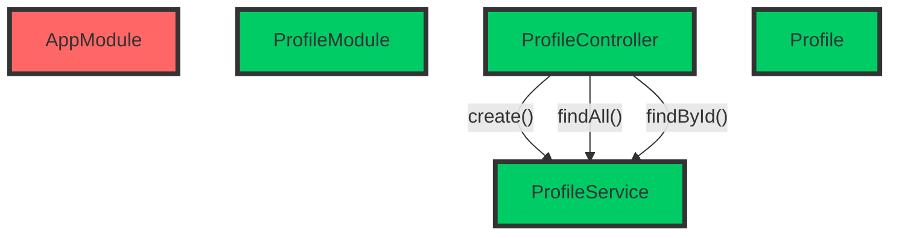
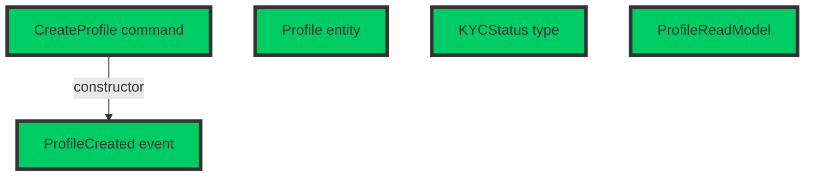
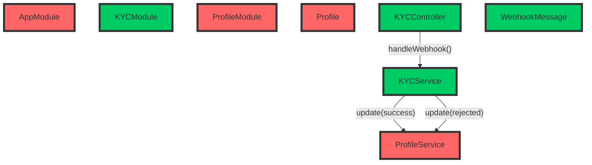
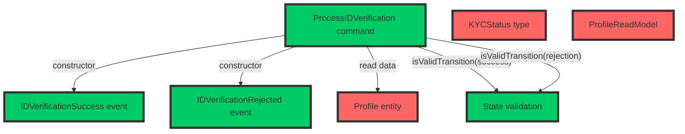
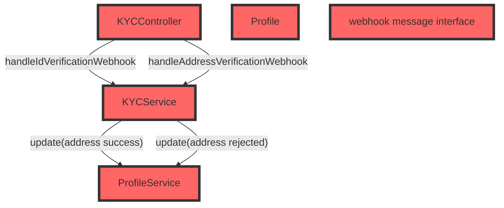
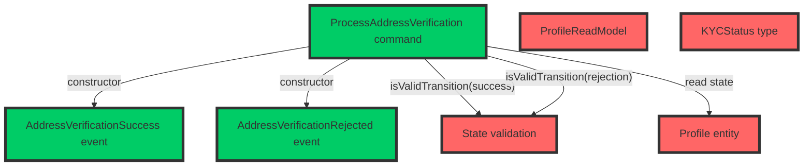

# Comparing complexity in MVC+CRUD vs. CQRS+ES

## Introduction

In software development projects, requirements are often described as user stories, which explain user intents and expectations (As `<someone>`, I want `<something>` because `<reason>`). Still, most backend systems nowadays are designed after the [Model-View-Controller (MVC)](https://en.wikipedia.org/wiki/Model–view–controller) design pattern, that describes software around the concept of Models (the M in MVC) that can be **C**reated, **R**ead, **U**pdated or **D**eleted (CRUD), handled by controllers and represented with views. This makes product and engineering teams speak slightly different languages that need a certain translation effort. Well-known frameworks like [Spring Boot](https://spring.io/projects/spring-boot) or [Ruby on Rails](https://rubyonrails.org) are good representatives of MVC/CRUD frameworks.

[Domain-Driven Design (DDD)](https://en.wikipedia.org/wiki/Domain-driven_design) aims to narrow this communication gap by using design patterns that are closer to the way humans and business stakeholders discuss the processes in their organizations. In DDD projects is frequent to use design patterns like [CQRS](https://www.martinfowler.com/bliki/CQRS.html) and [Event-Sourcing](https://martinfowler.com/eaaDev/EventSourcing.html). Each user intent is 1:1 represented in code as a `Command`, everything that happens is expressed as `Events` (records of facts), and the state can be aggregated and consumed as `Read Models`.

### Compound complexity

As a software system scales, and subsequently the team behind of it grows, it's easy to start noticing how changes become more and more costly as time passes. It becomes harder for engineers to fully understand the codebase, and coupling between different parts of it makes that even the slightest change requires major code updates, even in unexpected files, making it harder to estimate the cost of a new feature beforehand.

One of the most compelling arguments of [Event Modeling](https://eventmodeling.org), a reference methodology to describe and design DDD and event-driven systems, is that software that follows CQRS+Event Sourcing patterns keep the coupling low enough to flatten the complexity curve. In traditional MVC+CRUD systems that are designed as a stateful resource store (models), it's common to find use cases that need to operate with more than one model at the same time. These relationships have to be handled at every layer, building a network of relationships over time that never stops growing.

Every new connection added to the system, has a multiplicative effect in complexity, generating an effect that is very similar to compound interest. While the size of every individual change seems negligible, these changes compound with each other and end up growing exponentially, but this is so gradual that it's hard to notice until everyone in the team start thinking that it may be worth a full rewrite (almost never is).

### Does CQRS+ES actually solve this?

Intuitively, we perceive that we need less relationships between different parts of the codebase when implementing a CQRS+ES system. Command handlers are all self-contained, they can access the data, but they do not operate directly on data, they use it to make decisions, and the decisions do not alter the data directly, but are expressed as events, which again, are just data. The same happens with event handlers. Command and event handlers are stateless, and operate on data exclusively.

But we want to go beyond intuition and illustrate this with data. In this repository we have implemented the same application twice. The first implementation follows a standard MVC+CRUD approach using the [NestJS](https://nestjs.com) framework. The second one, follows a CQRS+ES approach using the [Booster Framework](https://boosterframework.com). Also, we will use the TypeScript programming language.

For each feature implemented, we will track the following quantitative data:

1. Number of files created and number of files changed/deleted.
2. Number of functions/classes refactored.
3. Lines of code added and lines of code deleted.
4. Explicit Links: Number of explicit calls added/changed to constructors/functions from a different file.

We will also summarize the changes and share impressions for each iteration, and you will find a conclusion at the end of this document. Each iteration will be pushed in a separate commit to ease detailed inspection of the work made, and allowing others to reach their own conclusions.

Last but not least, this is an open repository intended for learning, so any fork, Pull Request or comment will be more than welcomed, even if you have a radically different opinion than us.

## Project description

We will implement the backend of a fictional KYC process for an online bank that allows their users to sign up online. A KYC (Know Your Customer) process is the process that any financial service needs to go through for each of their clients, collecting customers' personal, familiar, and occupation data to make sure they're eligible to be clients according to current regulations.

Our focus is on architectural complexity, so we'll assume that the actual data verification will be handled by 3rd party services that are integrated with our backend. More details on the assumptions will be added on each feature description.

> Disclaimer: It's important to highlight that the KYC process described here is for demonstration purposes only, with the intent of illustrating architectural differences between two well-known software architectures. This example should not be taken as a reference for real-world applications. If you plan to implement a KYC process for your own organization, ensure you seek proper guidance and consult with legal and compliance experts to meet all applicable regulatory requirements.

We will divide the project in 5 major milestones:

1. User registration:

    * Collect basic user information, such as name, address, date of birth, and contact details.
    * Obtain the user's Social Security number (SSN) or Tax Identification Number (TIN).

2. Identity verification:

    * Forward the user to an ID/Passport verification platform.
    * Verify user's government-issued identification document (e.g., driver's license, passport, or state-issued ID card).

3. Address verification:

    * Forward the user to an address verification platform that will collect a recent utility bill or bank statement as proof of address.

4. Background check:

    * Check user's information against government watchlists, such as the Office of Foreign Assets Control (OFAC) and Politically Exposed Persons (PEP) lists.
    * Perform a manual risk assessment based on the user's profile, occupation, and financial activity.

5. Family and occupation information:

    * Obtain information about user's family members, particularly those who may have political influence or connections.
    * Collect information about the user's occupation, employer, and source of income.

### Repository Structure

You'll find the full code of both NestJS and Booster projects in the corresponding folders:

* [`kyc-nest`](kyc-nest): Contains the NestJS implementation, which follows the MVC architectural pattern.
* [`kyc-booster`](kyc-booster): Contains the Booster Framework implementation, which follows the CQRS + Event Sourcing architectural pattern.

To run the projects, follow the instructions provided in the README file in each folder.

## Logbook

### Milestone 0: Project preparation

Minimal setup to build empty projects. We won't collect data for this iteration.

#### NestJS project ([2513803](https://github.com/boostercloud/kyc-example/commit/2513803c85c50d1f9601404277d126c9cf7a584d))

1. Install NestJS CLI and create a new project.
2. Install SQLite and TypeORM libraries.
3. Update the `ormconfig.json` file to use SQLite.

#### Booster project ([19dff43](https://github.com/boostercloud/kyc-example/commit/19dff43cc8b4f1abec46e46e6c6c3dc400232844))

1. Install Booster CLI and create a new project.

### Milestone 1: Profile creation

Profile creation is the first step in the KYC process, where the user provides their basic information such as name, address, date of birth, contact details, Social Security number (SSN), or Tax Identification Number (TIN). In order to track the profile state during the KYC process, we will also have a `kycStatus` field in the `Profile` entity with an initial status of `KYCPending`.

#### NestJS implementation steps ([48601ff](https://github.com/boostercloud/kyc-example/commit/48601ff550dc2e85d44cbe7c7db408205741ecb9))

1. Create a `ProfileController` that implements handlers for creating and reading profile HTTP endpoints.
2. Create a `Profile` entity that describes the profile object schema, as well as the valid states, defaulting to the initial state `KYCPending`.
3. Create a `ProfileService` class that implements the creation and finder methods for the profiles database table.
4. Create a `ProfileModule` that glues all the pieces together.
5. Update the `AppModule` to import the new module.

| Files Created | Files Changed/Deleted | Refactors | LoC Added | LoC Deleted | Explicit Links |
| ------------- | --------------------- | --------- | --------- | ----------- | -------------- |
| 4             | 1                     | 0         | 120       | 0           | 3              |

#### Booster Framework implementation steps ([8b8b360](https://github.com/boostercloud/kyc-example/commit/8b8b36044678f8243abdcaee8e2ba820265788ff))

1. Create the `CreateProfile` command with the required fields.
2. Create a `types` file for shared types like the `KYCStatus`.
3. Create the `ProfileCreated` event.
4. Create the `Profile` entity and set up the reducer function.
5. Create the `ProfileReadModel` read model and set up the projection function.

| Files Created | Files Changed/Deleted | Refactors | LoC Added | LoC Deleted | Explicit Links |
| ------------- | --------------------- | --------- | --------- | ----------- | -------------- |
| 5             | 0                     | 0         | 113       | 0           | 1              |

#### Milestone 1: Conclusions

For this first use case, the amount of files created, updated, and lines of code added and deleted, are similar, but we can already see how Booster adds less than a half of the links required in NestJS. The direction of the relationships are different too: in NestJS we find a tree-like structure, where the (root module) `AppModule` links the new `ProfileModule`, and then this one links together the corresponding controller, model and service. Then, the `ProfileController` uses the `ProfileService` to fulfill the requests. In Booster, we find full separation of write (`CreateProfile command`) and read (`ProfileReadModel`) pipelines, as expected due to the CQRS design, and both pipelines are solely connected by the `ProfileCreated event`.

### Milestone 2: ID Verification

In this milestone, we implement the identity (ID) verification process. We will assume that the user was redirected to an external ID verification service that will call a webhook in our service with the corresponding success or rejection status. The profile's `KYCStatus` should be updated accordingly. Apart from handling the webhook, the implementation also takes care of validating transitions between `KYCStatus` states.

#### NestJS implementation steps ([224b56c](https://github.com/boostercloud/kyc-example/commit/224b56c2f317c65f3ee957f6364e276a87358bae))

1. Create a `KYCController` that listens for webhook messages from the external ID verification service.
2. Create a `WebhookMessage` interface that defines the expected shape of the webhook event payload.
3. Create a `KYCService` class that validates the webhook message, processes the ID verification result, and updates the user's `KYCStatus`.
4. Create a `KYCModule` that brings all the new elements together, and imports the `ProfileModule` since it depends on the `ProfileService`.
5. Update `ProfileService` to add the `updateKycStatus` method to update the user's `KYCStatus` and to handle verification status transitions rules.
6. Update `ProfileModule` to export `ProfileService` so it can be used in the `KYCModule`.
7. Update `Profile` entity file to add new valid states to the `KYCStatus` type.
8. Update `AppModule` to import the new `KYCModule`.

| Files Created | Files Changed/Deleted | Refactors | LoC Added | LoC Deleted | Explicit Links |
| ------------- | --------------------- | --------- | --------- | ----------- | -------------- |
| 4             | 4                     | 0         | 126       | 1           | 3              |

#### Booster Framework implementation steps ([4348e15](https://github.com/boostercloud/kyc-example/commit/8e15b5ccf72ef260bbb35b12a5605ebe5c970eb1))

1. Create the `ProcessIDVerification` command with the expected fields coming from the webhook.
2. Create the `IDVerificationSuccess` event.
3. Create the `IDVerificationRejected` event.
4. Create a `state-validation.ts` with a function for state transition validation.
5. Modify the `types.ts` file to add new valid states to the `KYCStatus` type (`KYCIDVerified` and `KYCIDRejected`)
6. Update the `Profile` entity with reducer functions for handling the new `IDVerificationSuccess` and `IDVerificationRejected` events.
7. Update the `ProfileReadModel` to add the new fields that expose verification metadata.

| Files Created | Files Changed/Deleted | Refactors | LoC Added | LoC Deleted | Explicit Links |
| ------------- | --------------------- | --------- | --------- | ----------- | -------------- |
| 4             | 3                     | 0         | 116       | 2           | 5              |

#### Milestone 2: Conclusions

In this scenario, the statistics are very similar. This change involved structural changes in both projects for state management. In the NestJS project, we added a new `KYCController` to handle the verification webhook using `KYCService`. Then, the `KYCService` uses the `ProfilesModule` to explicitly update the entity.

In Booster, we introduced a new command that makes use of the existing entity and a new state validation function before accepting the incoming request, so all orchestration for this use case is made by the command itself, keeping the new use case self-contained. State management is handled treating the events and entities as data, so no explicit state management is needed, showing a better distribution of responsibilities.

### Milestone 3: Address Verification

In this milestone, we implement the address verification process. As we did the ID verification process, we'll simulate that we redirect the user to an external verification service. This service will then call our KYC service back with the verification outcome (Success or rejected). We must update the profile's `KYCStatus` to reflect this result. In addition to processing the webhook, our implementation is also responsible for ensuring the validity of transitions between different `KYCStatus` states.

#### NestJS implementation steps ([bec8b97](https://github.com/boostercloud/kyc-example/commit/bec8b973316af3225469885a59c87d56ee688607))

1. Refactor the `KYCController` to separate ID verification and address verification webhook handlers.
2. Refactor the `KYCService` to create separate methods for handling ID verification and address verification webhook messages.
3. Update the `webhook-message.interface.ts` file to rename the existing interface of the ID verification webhook schema and add a new one for address verification.
4. Update the `Profile` file to add new valid states to the `KYCStatus` type for address verification (`KYCAddressVerified` and `KYCAddressRejected`) as well as new fields to keep track of validation.
5. Refactored the `ProfileService` to better handle address verification status transitions.

| Files Created | Files Changed/Deleted | Refactors | LoC Added | LoC Deleted | Explicit Links |
| ------------- | --------------------- | --------- | --------- | ----------- | -------------- |
| 0             | 5                     | 3         | 116       | 18          | 4              |

#### Booster implementation steps ([727d3ce](https://github.com/boostercloud/kyc-example/commit/727d3ce6f062784250b905336bcc44d27a4c6028))

1. Create the command `ProcessAddressVerification` with the expected fields coming from the webhook.
2. Created the `AddressVerificationRejected` event.
3. Created the `AddressVerificationSuccess` event.
4. Updated the `Profile` entity to reduce the new events and add new fields.
5. Updated the `ProfileReadModel` to expose the new fields.
6. Refactored the helper functions in the `state-validation.ts` file to handle the new states.
7. Updated the `types.ts` file to add the new required states (`KYCAddressVerified` and `KYCAddressRejected`)

| Files Created | Files Changed/Deleted | Refactors | LoC Added | LoC Deleted | Explicit Links |
| ------------- | --------------------- | --------- | --------- | ----------- | -------------- |
| 3             | 4                     | 1         | 156       | 16          | 5              |

#### Milestone 3: Conclusions

In this iteration we see a few differences between the two codebases:

* As we're reusing the existing `KYCController` in NestJS, we didn't add any new files. All changes required changing existing files. This required extra refactors in two files, to accomodate the new features in an idiomatic way, and this refactor introduced a breaking API change.
* In Booster, the new use case was implemented as a brand new command, so no previous code was affected. Also, we see the pattern from the previous iteration again: all orchestration between different modules are made in the command. This means that this feature can be easily developed in isolation.
* One detail worth noting from the NestJS project is that we, as developers, are responsible to decide whether to include new functionality in an existing controller or create a new one. This means that there's a higher variability on the application design, as some developers might decide to create new controllers for each features, and others might decide to avoid refactoring existing code despite ending up with code that's not easy to understand. In the Booster the framework, the framework architecture clearly defines how to add new functionality, making Booster projects potentially more repeatable.
* We also refactored the state validation function in both projects, which didn't introduce API changes.
