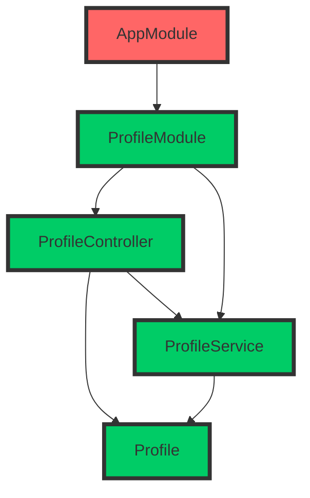
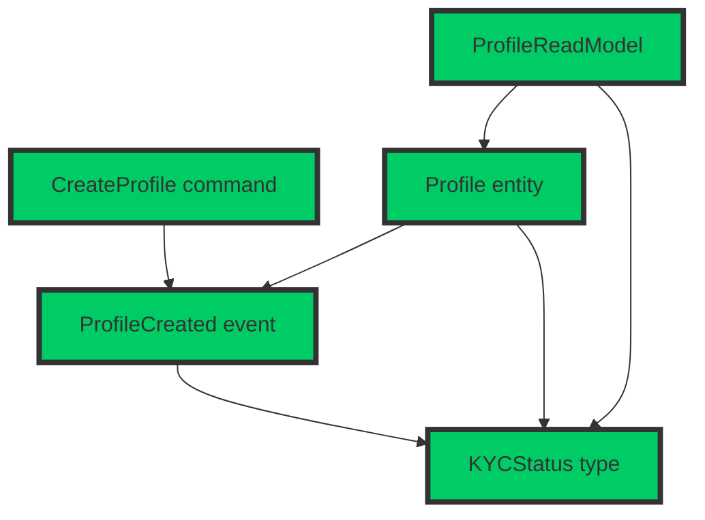

# Comparing how complexity is handled in MVC and CQRS+ES Environments

This repository provides a side-by-side comparison of two software architectures: Model-View-Controller (MVC) and Command Query Responsibility Segregation (CQRS) with Event Sourcing (ES). The goal is to demonstrate how each approach handles complexity in a real-world scenario, specifically when implementing a Know Your Customer (KYC) process for an online bank.

We have created two separate implementations: one using NestJS (MVC) and the other using the Booster Framework (CQRS + ES). By inspecting both implementations, you can get a better understanding of the advantages and trade-offs of each approach in terms of code organization, separation of concerns, and developer experience.

## Reference KYC process outline

> Disclaimer: We have implemented a representative KYC process for demonstration purposes only, with the intent of illustrating architectural differences between two well-known software architectures. This example should not be taken as a reference for real-world applications. If you plan to implement a KYC process for your own organization, ensure you seek proper guidance and consult with legal and compliance experts to meet all applicable regulatory requirements.

1. User registration:

    * Collect basic user information, such as name, address, date of birth, and contact details.
    * Obtain the user's Social Security number (SSN) or Tax Identification Number (TIN).

2. Identity verification:

    * Forward the user to an ID/Passport verification platform.
    * Verify user's government-issued identification document (e.g., driver's license, passport, or state-issued ID card).

3. Address verification:

    * Collect a recent utility bill or bank statement as proof of address.
    * Verify the provided document to ensure it matches the registered address.

4. Background check:

    * Check user's information against government watchlists, such as the Office of Foreign Assets Control (OFAC) and Politically Exposed Persons (PEP) lists.
    * Perform a risk assessment based on the user's profile, occupation, and financial activity.

5. Family and occupation information:

    * Obtain information about user's family members, particularly those who may have political influence or connections.
    * Collect information about the user's occupation, employer, and source of income.

6. Ongoing monitoring:

    * Continuously monitor the user's account activity to identify any unusual or suspicious transactions.
    * Conduct periodic reviews of the user's information and update the risk assessment accordingly.

## Repository Structure

The repository is organized into two main folders:

* `kyc-nest`: Contains the NestJS implementation, which follows the MVC architectural pattern.
* `kyc-booster`: Contains the Booster Framework implementation, which follows the CQRS + Event Sourcing architectural pattern.

## Getting Started

To run and explore each implementation, follow the instructions provided in the README file inside each folder.

## Comparison Criteria

When comparing the two implementations, we'll focus mainly on the number of files created and the number of files changed as well as the dependencies of each file, representing them graphically for easier understanding. For each step, we'll also highlight the overall experience regarding semantics and structure, but the main point we want to demonstrate is that code complexity in MVC projects is compound over time while it remains relatively linear in a CQRS/ES project.

## Logbook

For each milestone, we'll provide:

1. A summary of the significant steps required to fulfill the use case.
2. The full diff of the change to allow you to inspect the changes.
3. A Mermaid diagram highlighting the additions, changes and relations.

### Milestone 0: Project preparation

Minimal setup to create an empty project in which we can start adding use cases.

#### NestJS project ([2513803](https://github.com/boostercloud/kyc-example/commit/2513803c85c50d1f9601404277d126c9cf7a584d))

1. Install NestJS CLI and create a new project.
2. Install SQLite and TypeORM libraries.
3. Update the `ormconfig.json` file to use SQLite.

#### Booster project ([19dff43](https://github.com/boostercloud/kyc-example/commit/19dff43cc8b4f1abec46e46e6c6c3dc400232844))

1. Install Booster CLI and create a new project.

#### Comparation

This step is not related to the MVC vs. CQRS/ES comparison, but it's still worth noting that NestJS don't make any assumptions on how you're storing the data, so it requires some extra steps like chosing an ORM, installing the library and configuring it to use your database of choice. Booster is more opinionated, so it comes with a pre-configured environment in which you can start working right away with no configuration at all.

### Milestone 1: Profile creation

Profile creation is the first step in the KYC process, where the user provides their basic information such as name, address, date of birth, contact details, Social Security number (SSN), or Tax Identification Number (TIN). This step is crucial to start the identity verification process. As a requirement, the profile must be created with an initial status of "KYCPending".

#### NestJS implementation steps ([4ed4953](https://github.com/boostercloud/kyc-example/commit/4ed4953b366d7de49a5d4fac64330914939a52ee))

1. Create a `ProfileController` that implements handlers for creating and reading profile HTTP endpoints.
2. Create a `Profile` entity that describes the profile object schema, as well as the valid states, defaulting to the initial state `KYCPending`.
3. Create a `ProfileService` class that implements the creation and finder methods for the profiles database table.
4. Create a `ProfileModule` that glues all the pieces together.
5. Update the `AppModule` to import the new module.

#### Booster Framework implementation steps ([3457070](https://github.com/boostercloud/kyc-example/commit/3457070ad63d3dbb5e4df05b9340130ea52c548b))

1. Create the `CreateProfile` command with the required fields.
2. Create a `types` file for shared types like the `KYCStatus`.
3. Create the `ProfileCreated` event.
4. Create the `Profile` entity and set up the reducer function.
5. Create the `ProfileReadModel` read model and set up the projection function.

#### Comparation

Comparing the lists for this initial use case, we can see that the Booster Framework already requires fewer steps to implement the profile creation feature. Also, the steps in Booster are more focused on the business logic and require less boilerplate code, making it simpler to reason about the system. The NestJS implementation involves more setup and configuration steps, which may not directly relate to the core business logic of the feature.
