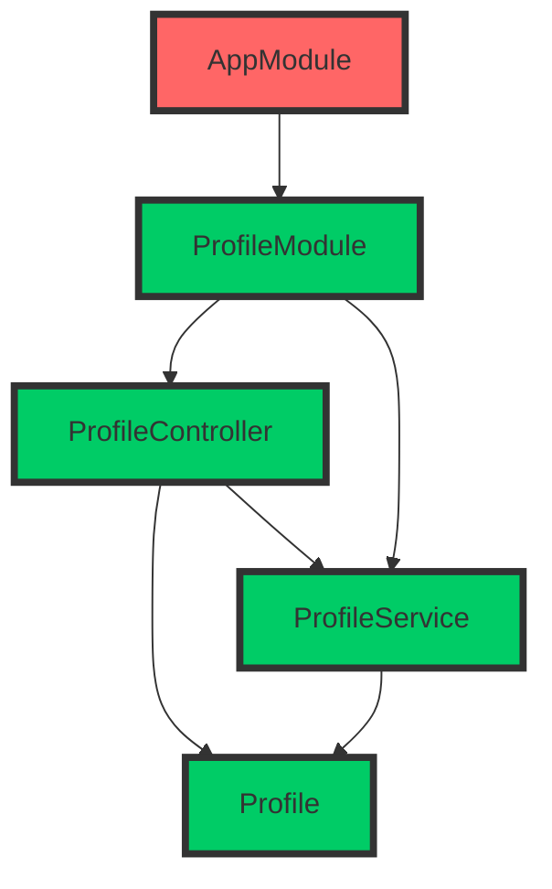
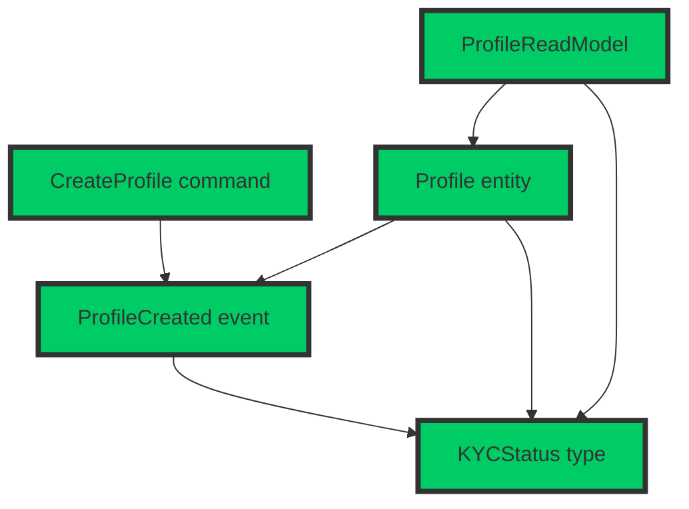
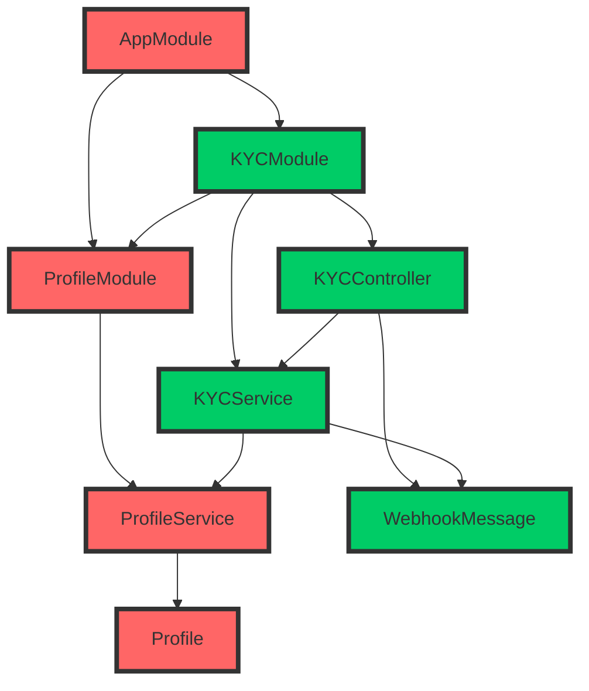
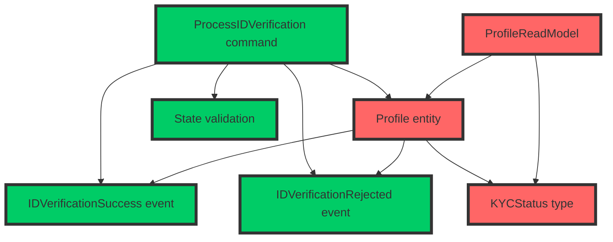
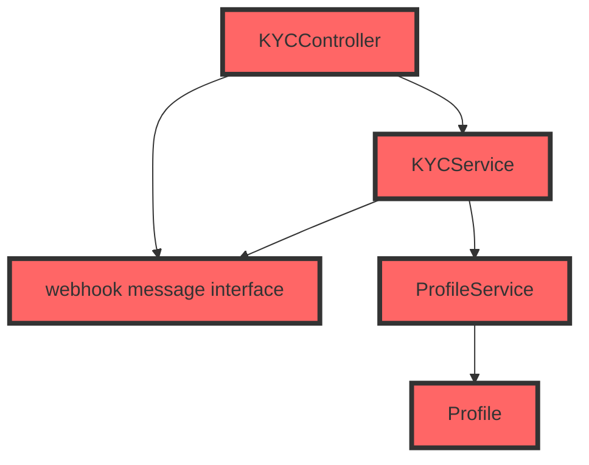
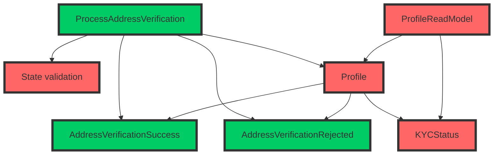
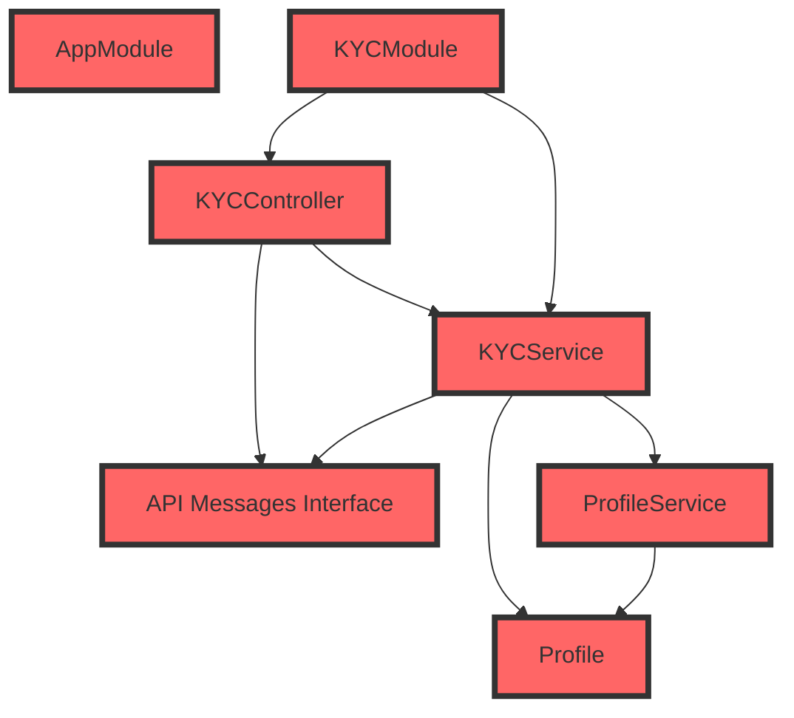

# Comparing how complexity is handled in MVC and CQRS+ES Environments

This repository provides a side-by-side comparison of two software architectures: Model-View-Controller (MVC) and Command Query Responsibility Segregation (CQRS) with Event Sourcing (ES). The goal is to demonstrate how each approach handles complexity in a real-world scenario, specifically when implementing a Know Your Customer (KYC) process for an online bank.

We have created two separate implementations: one using NestJS (MVC) and the other using the Booster Framework (CQRS + ES). By inspecting both implementations, you can get a better understanding of the advantages and trade-offs of each approach in terms of code organization, separation of concerns, and developer experience.

## Reference KYC process outline

> Disclaimer: We have implemented a representative KYC process for demonstration purposes only, with the intent of illustrating architectural differences between two well-known software architectures. This example should not be taken as a reference for real-world applications. If you plan to implement a KYC process for your own organization, ensure you seek proper guidance and consult with legal and compliance experts to meet all applicable regulatory requirements.

1. User registration:

    * Collect basic user information, such as name, address, date of birth, and contact details.
    * Obtain the user's Social Security number (SSN) or Tax Identification Number (TIN).

2. Identity verification:

    * Forward the user to an ID/Passport verification platform.
    * Verify user's government-issued identification document (e.g., driver's license, passport, or state-issued ID card).

3. Address verification:

    * Collect a recent utility bill or bank statement as proof of address.
    * Verify the provided document to ensure it matches the registered address.

4. Background check:

    * Check user's information against government watchlists, such as the Office of Foreign Assets Control (OFAC) and Politically Exposed Persons (PEP) lists.
    * Perform a risk assessment based on the user's profile, occupation, and financial activity.

5. Family and occupation information:

    * Obtain information about user's family members, particularly those who may have political influence or connections.
    * Collect information about the user's occupation, employer, and source of income.

6. Ongoing monitoring:

    * Continuously monitor the user's account activity to identify any unusual or suspicious transactions.
    * Conduct periodic reviews of the user's information and update the risk assessment accordingly.

## Repository Structure

The repository is organized into two main folders:

* `kyc-nest`: Contains the NestJS implementation, which follows the MVC architectural pattern.
* `kyc-booster`: Contains the Booster Framework implementation, which follows the CQRS + Event Sourcing architectural pattern.

## Getting Started

To run and explore each implementation, follow the instructions provided in the README file inside each folder.

## Comparison Criteria

When comparing the two implementations, we'll focus mainly on the number of files created and the number of files changed as well as the dependencies of each file, representing them graphically for easier understanding. For each step, we'll also highlight the overall experience regarding semantics and structure, but the main point we want to demonstrate is that code complexity in MVC projects is compound over time while it remains relatively linear in a CQRS/ES project.

## Logbook

For each milestone, we'll provide:

1. A summary of the significant steps required to fulfill the use case.
2. The full diff of the change to allow you to inspect the changes.
3. A Mermaid diagram highlighting the additions, changes and relations.

### Milestone 0: Project preparation

Minimal setup to create an empty project in which we can start adding use cases.

#### NestJS project ([2513803](https://github.com/boostercloud/kyc-example/commit/2513803c85c50d1f9601404277d126c9cf7a584d))

1. Install NestJS CLI and create a new project.
2. Install SQLite and TypeORM libraries.
3. Update the `ormconfig.json` file to use SQLite.

#### Booster project ([19dff43](https://github.com/boostercloud/kyc-example/commit/19dff43cc8b4f1abec46e46e6c6c3dc400232844))

1. Install Booster CLI and create a new project.

#### Milestone 0 comparison

This step is not related to the MVC vs. CQRS/ES comparison, but it's still worth noting that NestJS don't make any assumptions on how you're storing the data, so it requires some extra steps like chosing an ORM, installing the library and configuring it to use your database of choice. Booster is more opinionated, so it comes with a pre-configured environment in which you can start working right away with no configuration at all.

### Milestone 1: Profile creation

Profile creation is the first step in the KYC process, where the user provides their basic information such as name, address, date of birth, contact details, Social Security number (SSN), or Tax Identification Number (TIN). This step is crucial to start the identity verification process. As a requirement, the profile must be created with an initial status of "KYCPending".

#### NestJS implementation steps ([4ed4953](https://github.com/boostercloud/kyc-example/commit/4ed4953b366d7de49a5d4fac64330914939a52ee))

1. Create a `ProfileController` that implements handlers for creating and reading profile HTTP endpoints.
2. Create a `Profile` entity that describes the profile object schema, as well as the valid states, defaulting to the initial state `KYCPending`.
3. Create a `ProfileService` class that implements the creation and finder methods for the profiles database table.
4. Create a `ProfileModule` that glues all the pieces together.
5. Update the `AppModule` to import the new module.

#### Booster Framework implementation steps ([3457070](https://github.com/boostercloud/kyc-example/commit/3457070ad63d3dbb5e4df05b9340130ea52c548b))

1. Create the `CreateProfile` command with the required fields.
2. Create a `types` file for shared types like the `KYCStatus`.
3. Create the `ProfileCreated` event.
4. Create the `Profile` entity and set up the reducer function.
5. Create the `ProfileReadModel` read model and set up the projection function.

#### Milestone 1 comparison

Comparing the lists for this initial use case, we can see that the Booster Framework already requires fewer steps to implement the profile creation feature. Also, the steps in Booster are more focused on the business logic and require less boilerplate code, making it simpler to reason about the system. The NestJS implementation involves more setup and configuration steps, which may not directly relate to the core business logic of the feature. It's noticeable that even when this is the first use case implemented in the application, the NestJS project already required a small change in pre-existing code.

### Milestone 2: ID Verification

In this milestone, we implement the identity (ID) verification process. The user's ID is sent out to an external verification service, which will return a success or rejection status. The profile's `KYCStatus` should be updated accordingly. Apart from handling the webhook, the implementation also takes care of validating transitions between `KYCStatus` states.

#### NestJS implementation steps ([224b56c](https://github.com/boostercloud/kyc-example/commit/224b56c2f317c65f3ee957f6364e276a87358bae))

1. Create a `KYCController` that listens for webhook messages from the external ID verification service.
2. Create a `WebhookMessage` interface that defines the expected shape of the webhook event payload.
3. Create a `KYCService` class that validates the webhook message, processes the ID verification result, and updates the user's `KYCStatus`.
4. Create a `KYCModule` that brings all the new elements together, and imports the `ProfileModule` since it depends on the `ProfileService`.
5. Update `ProfileService` to add the `updateKycStatus` method to update the user's `KYCStatus` and to handle verification status transitions rules.
6. Update `ProfileModule` to export `ProfileService` so it can be used in the `KYCModule`.
7. Update `Profile` entity file to add new valid states to the `KYCStatus` type.
8. Update `AppModule` to import the new `KYCModule`.

#### Booster Framework implementation steps ([4348e15](https://github.com/boostercloud/kyc-example/commit/8e15b5ccf72ef260bbb35b12a5605ebe5c970eb1))

1. Create the `ProcessIDVerification` command with the expected fields coming from the webhook.
2. Create the `IDVerificationSuccess` event.
3. Create the `IDVerificationRejected` event.
4. Create a `state-validation.ts` with a function for state transition validation.
5. Modify the `types.ts` file to add new valid states to the `KYCStatus` type (`KYCIDVerified` and `KYCIDRejected`)
6. Update the `Profile` entity with reducer functions for handling the new `IDVerificationSuccess` and `IDVerificationRejected` events.
7. Update the `ProfileReadModel` to add the new fields that expose verification metadata.

#### Milestone 2 comparison

Again, Booster Framework requires one step less than NestJS, but more importantly, the changes in Booster are more semantic and closer to business language; all files created in Booster represent specific business concepts, while the NestJS implementation files are more related to framework structural artifacts.

From a code organization perspective, Booster's approach provides a clear separation of concerns, as each command or event-related functionality is handled by separate files or functions, and each artifact in our project is centered on a single specific goal while some files in the MVC implementation are required just to manage the project's structure. This makes it easier to reason about the code.

### Milestone 3: Address Verification

In this milestone, we focus on implementing the address verification process. Just like the ID verification process, we'll send the user's address along with relevant documents to an external verification service. This service will then provide us with either a success or rejection status based on the address verification outcome. We must update the profile's `KYCStatus` to reflect this result. In addition to processing the webhook, our implementation is also responsible for ensuring the validity of transitions between different `KYCStatus` states.

#### NestJS implementation steps ([e4e0b98](https://github.com/boostercloud/kyc-example/commit/e4e0b987c9d3436b770ede0345689e42a4e626ee))

1. Refactor the `KYCController` to separate ID verification and address verification webhook handlers.
2. Refactor the `KYCService` to create separate methods for handling ID verification and address verification webhook messages.
3. Update the `webhook-message.interface.ts` file to rename the existing interface of the ID verification webhook schema and add a new one for address verification.
4. Update the `Profile` file to add new valid states to the `KYCStatus` type for address verification (`KYCAddressVerified` and `KYCAddressRejected`) as well as new fields to keep track of validation.
5. Refactored the `ProfileService` to better handle address verification status transitions.

#### Booster implementation steps ([3c90c1f](https://github.com/boostercloud/kyc-example/commit/3c90c1f1d6f5c939486fd107fa9ebfe59e0f209a))

1. Create the command `ProcessAddressVerification` with the expected fields coming from the webhook.
2. Created the `AddressVerificationRejected` event.
3. Created the `AddressVerificationSuccess` event.
4. Updated the `Profile` entity to reduce the new events and add new fields.
5. Updated the `ProfileReadModel` to expose the new fields.
6. Refactored the helper functions in the `state-validation.ts` file to handle the new states.
7. Updated the `types.ts` file to add the new required states (`KYCAddressVerified` and `KYCAddressRejected`)

#### Milestone 3 comparison

In this iteration, fewer files required modification in the NestJS project, but all changes were updates to existing files. We needed to refactor three files to resolve a name conflict with the pre-existing `/webhook` endpoint, which introduced a breaking change. In the Booster project, a minor refactor of a helper function was necessary, but it did not result in any breaking API changes.

With better planning, we might have avoided the breaking API change in the NestJS project. However, it is common for MVC designs to require modifications to existing code when adding new use cases. On the other hand, we can observe that adding a new use case in Booster involves creating new commands and events and updating the entity to accommodate the effects of new events. In the CQRS/ES model, all changes are confined within the context of the affected entities, and actions are decoupled from the entities, allowing them to be created independently. In the NestJS project, we must decide whether to include new functionality in an existing controller or create a new one. Furthermore, when two resources need to collaborate, we need to introduce changes across multiple services so, as the code becomes more complex, it becomes more likely that we need to change existing working code.

### Milestone 4: Background check

In this milestone we will simulate an automated background check process. When the profile reaches the state `KYCAddressVerified`, we will make a series of simulated requests to the OFAC (Office of Foreign Assets Control) and the PEP (Political Exposed Person) databases to check if the user is in any of these lists. If the user is not on these lists, it will be set in the state `KYCBackgroundCheckPassed` automatically, but if they're present in any of these lists, it will be moved to a `KYCBackgroundCheckRequiresManualReview` state that a human will have to resolve. We will then expose a new endpoint to allow the reviewer sending the final veredict, which can pass the user to either the `KYCBackgroundCheckPassed` or the `KYCBackgroundCheckRejected` state.

#### NestJS implementation steps ([ed012a1](https://github.com/boostercloud/kyc-example/commit/ed012a1dc86a42519c66a85d1090d612ac947456))

1. Minor change in the `AppModule` to enable environment variables.
2. Renamed and updated the file that holds the KYC API messages, now named `API Messages interfaces`.
3. Updated the `KYCController` to add a new `/submit-manual-background-check` endpoint.
4. Minor update in the `KYCModule` to enable access to environment variables.
5. Changed the `handleAddressVerification` method in `KYCService` to chain the background check after the address has been validated and added all the logic needed to perform the corresponding HPPT calls to the simulated external services.
6. Changed the `Profile` entity file to add the new states and fields.
7. Changed the `ProfileService` to handle the new states.

### Milestone 5: Family and occupation risk assessment

In this milestone, we'll add occupation information to the existing profiles and introduce the concept of relative, adding a 1-M relationship. We're going to assume that all this information will be vetted manually by the organization employee, so we'll just implement collection of the data and its exposure via API.

