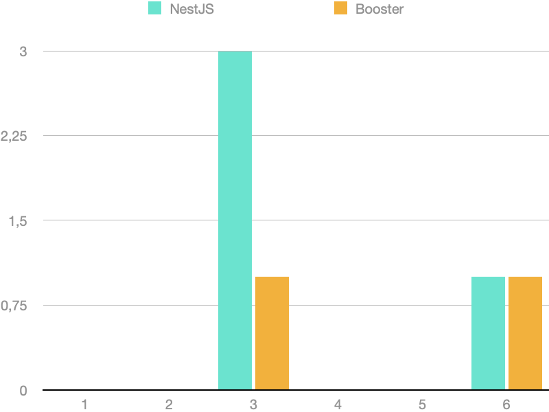
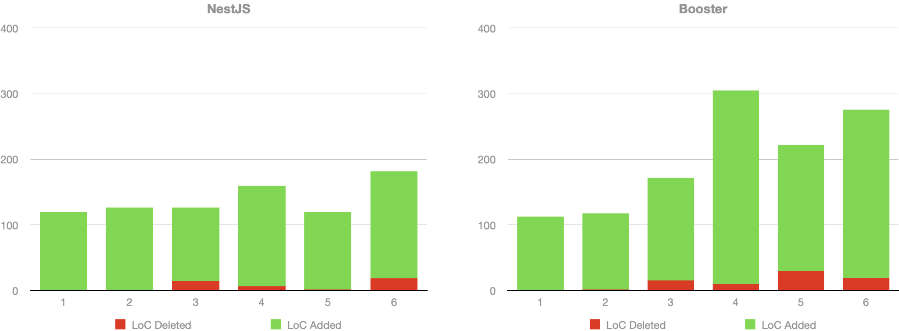

# Comparing complexity in MVC+CRUD vs. CQRS+ES

## Introduction

In software development projects, requirements are often described as user stories, which explain user intents and expectations (As `<someone>`, I want `<something>` because `<reason>`). Still, most backend systems nowadays are designed after the [Model-View-Controller (MVC)](https://en.wikipedia.org/wiki/Model–view–controller) design pattern, that describes software around the concept of Models (the M in MVC) that can be **C**reated, **R**ead, **U**pdated or **D**eleted (CRUD), handled by controllers and represented with views. This makes product and engineering teams speak slightly different languages that need a certain translation effort. Well-known frameworks like [Spring Boot](https://spring.io/projects/spring-boot), [NestJS](https://nestjs.com) or [Ruby on Rails](https://rubyonrails.org) are good representatives of MVC/CRUD frameworks.

[Domain-Driven Design (DDD)](https://en.wikipedia.org/wiki/Domain-driven_design) aims to narrow this communication gap by using design patterns that are closer to the way humans and business stakeholders discuss the processes in their organizations. In DDD projects is frequent to use design patterns like [CQRS](https://www.martinfowler.com/bliki/CQRS.html) and [Event-Sourcing](https://martinfowler.com/eaaDev/EventSourcing.html). Each user intent is 1:1 represented in code as a `Command`, everything that happens is expressed as `Events` (records of facts), and the state can be aggregated and consumed as `Read Models`.

### Compound complexity

As a software system scales, and subsequently the team behind of it grows, it's easy to start noticing how changes become more and more costly as time passes. It becomes harder for engineers to fully understand the codebase, and coupling between different parts of it makes that even the slightest change requires major code updates, even in unexpected files, making it harder to estimate the cost of a new feature beforehand.

One of the most compelling arguments of [Event Modeling](https://eventmodeling.org), a reference methodology to describe and design DDD and event-driven systems, is that software that follows CQRS+Event Sourcing patterns keep the coupling low enough to flatten the complexity curve. In traditional MVC+CRUD systems that are designed as a stateful resource store (models), it's common to find use cases that need to operate with more than one model at the same time. These relationships have to be handled at every layer, building a network of relationships over time that never stops growing.

Every new connection added to the system, has a multiplicative effect in complexity, generating an effect that is very similar to compound interest. While the size of every individual change seems negligible, these changes compound with each other and end up growing exponentially, but this is so gradual that it's hard to notice until everyone in the team start thinking that it may be worth a full rewrite (almost never is).

### Does CQRS+ES actually solve this?

Intuitively, we perceive that we need less relationships between different parts of the codebase when implementing a CQRS+ES system. Command handlers are all self-contained, they can access the data, but they do not need to cooperate with different components that handle the data, they use it to make decisions, and the decisions do not alter the data directly, but are expressed as events, which again, are just data. The same happens with event handlers. Commands and event handlers are stateless, and operate on data exclusively.

But we want to go beyond intuition and illustrate this with examples. In this repository we have implemented the same application twice. The first implementation follows a standard MVC+CRUD approach using the [NestJS](https://nestjs.com) framework. The second one, follows a CQRS+ES approach using the [Booster Framework](https://boosterframework.com). Also, we will use the TypeScript programming language.

For each feature implemented, we will track the following quantitative data:

1. Number of files created and number of files changed/deleted.
2. Number of functions/classes refactored.
3. Lines of code added and lines of code deleted.
4. Imported Files: Increase of imports (new imports - removed imports)
5. Function calls: Number of explicit calls added/changed to functions imported from a different file.

The goal of using these metrics is to build a perception on how the code is organized, the impact of changes, and how different components use other components.

We will also summarize the changes and share impressions for each iteration, and you will find a conclusion at the end of this document. Each iteration will be pushed in a separate commit to ease detailed inspection of the work made, and allowing others to reach their own conclusions.

Last but not least, this is an open repository intended for learning, so any fork, Pull Request or comment will be more than welcomed, even if you have a radically different way of interpreting the data.

## Project description

We will implement the backend of a fictional KYC process for an online bank that allows their users to sign up online. A KYC (Know Your Customer) process is the process that any financial service needs to go through for each of their clients, collecting customers' personal, familiar, and occupation data to make sure they're eligible to be clients according to current regulations.

Our focus is on architectural complexity, so we'll assume that the actual data verification will be handled by 3rd party services that are integrated with our backend. More details on the assumptions will be added on each feature description.

> Disclaimer: It's important to highlight that the KYC process described here is for demonstration purposes only, with the intent of illustrating architectural differences between two well-known software architectures. This example should not be taken as a reference for real-world applications. If you plan to implement a KYC process for your own organization, ensure you seek proper guidance and consult with legal and compliance experts to meet all applicable regulatory requirements.

We will divide the project in 6 major milestones:

1. User registration:

    * Collect basic user information, such as name, address, date of birth, and contact details.
    * Obtain the user's Social Security number (SSN) or Tax Identification Number (TIN).

2. Identity verification:

    * Forward the user to an ID/Passport verification platform.
    * Verify user's government-issued identification document (e.g., driver's license, passport, or state-issued ID card).

3. Address verification:

    * Forward the user to an address verification platform that will collect a recent utility bill or bank statement as proof of address.

4. Background check:

    * Check user's information against government watchlists, such as the Office of Foreign Assets Control (OFAC) and Politically Exposed Persons (PEP) lists.
    * Perform a manual risk assessment based on the user's profile, occupation, and financial activity.

5. Family and occupation information:

    * Obtain information about user's family members, particularly those who may have political influence or connections.
    * Collect information about the user's occupation, employer, and source of income.

6. Plot twist!

    * Requirements changed and we need to skip the address verification step when the profile's owner comes from Wakanda.
    * Additionally, we will send a welcome email when the process is finished, but wakandians will receive a promo code to buy vibranium in the nearest hardware store.

### Repository Structure

You'll find the full code of both NestJS and Booster projects in the corresponding folders:

* [`kyc-nest`](kyc-nest): Contains the NestJS implementation, which follows the MVC + CRUD architectural pattern.
* [`kyc-booster`](kyc-booster): Contains the Booster Framework implementation, which follows the CQRS + Event Sourcing architectural pattern.

To run the projects, refer to the instructions provided in the README file for each folder.

## Logbook

For each iteration we will show a description of the changes, a mermaid diagram that shows the edited artifacts (in green the new ones, in red the changed ones), dotted arrows for imports (light dependency), and regular arrows with labels representing explicit function calls (strong dependencies that could force a change in the dependent file).

Example:

### Milestone 0: Project preparation

Minimal setup to build empty projects. We won't collect data for this iteration.

#### NestJS project ([2513803](https://github.com/boostercloud/kyc-example/commit/2513803c85c50d1f9601404277d126c9cf7a584d))

1. Install NestJS CLI and create a new project.
2. Install SQLite and TypeORM libraries.
3. Update the `ormconfig.json` file to use SQLite.

#### Booster project ([19dff43](https://github.com/boostercloud/kyc-example/commit/19dff43cc8b4f1abec46e46e6c6c3dc400232844))

1. Install Booster CLI and create a new project.

### Milestone 1: Profile creation

Profile creation is the first step in the KYC process, where the user provides their basic information such as name, address, date of birth, contact details, Social Security number (SSN), or Tax Identification Number (TIN). In order to track the profile state during the KYC process, we will also have a `kycStatus` field in the `Profile` entity with an initial status of `KYCPending`.

#### NestJS implementation steps ([48601ff](https://github.com/boostercloud/kyc-example/commit/48601ff550dc2e85d44cbe7c7db408205741ecb9))

1. Create a `ProfileController` that implements handlers for creating and reading profile HTTP endpoints.
2. Create a `Profile` entity that describes the profile object schema, as well as the valid states, defaulting to the initial state `KYCPending`.
3. Create a `ProfileService` class that implements the creation and finder methods for the profiles database table.
4. Create a `ProfileModule` that glues all the pieces together.
5. Update the `AppModule` to import the new module.

| Files Created | Files Changed/Deleted | Refactors | LoC Added | LoC Deleted | Imports | Function calls |
| ------------- | --------------------- | --------- | --------- | ----------- | ------- | -------------- |
| 4             | 1                     | 0         | 120       | 0           | 7       | 2              |

#### Booster Framework implementation steps ([8b8b360](https://github.com/boostercloud/kyc-example/commit/8b8b36044678f8243abdcaee8e2ba820265788ff))

1. Create the `CreateProfile` command with the required fields.
2. Create a `types` file for shared types like the `KYCStatus`.
3. Create the `ProfileCreated` event.
4. Create the `Profile` entity and set up the reducer function.
5. Create the `ProfileReadModel` read model and set up the projection function.

| Files Created | Files Changed/Deleted | Refactors | LoC Added | LoC Deleted | Imports | Function calls |
| ------------- | --------------------- | --------- | --------- | ----------- | ------- | -------------- |
| 5             | 0                     | 0         | 113       | 0           | 6       | 0              |

#### Milestone 1: Conclusions

For this first use case, the number of files touched, the amount of limes added and the number of imports are similar, but we can see how Booster architecture implements the same functionality with no explicit function calls while in NestJS we need to explictly link the `ProfileController` handlers with the corresponding functions in the `ProfileService`. Looking at the diagram, we can notice the architecture differences. In NestJS, we're grouping the code around the entities, building a dedicated module for our profile, with a single controller that manages both reads and writes. In Booster, each piece is independent. The command only depends on the event and doesn't need to interact with the entity, the entity is created in a self-contained process that only depends on the event, and the read models only need the entity to generate the API data.

### Milestone 2: ID Verification

In this milestone, we implement the identity (ID) verification process. We will assume that the user was redirected to an external ID verification service that will call a webhook in our service with the corresponding success or rejection status. The profile's `KYCStatus` should be updated accordingly. Apart from handling the webhook, the implementation also takes care of validating transitions between `KYCStatus` states.

#### NestJS implementation steps ([224b56c](https://github.com/boostercloud/kyc-example/commit/224b56c2f317c65f3ee957f6364e276a87358bae))

1. Create a `KYCController` that listens for webhook messages from the external ID verification service.
2. Create a `WebhookMessage` interface that defines the expected shape of the webhook event payload.
3. Create a `KYCService` class that validates the webhook message, processes the ID verification result, and updates the user's `KYCStatus`.
4. Create a `KYCModule` that brings all the new elements together, and imports the `ProfileModule` since it depends on the `ProfileService`.
5. Update `ProfileService` to add the `updateKycStatus` method to update the user's `KYCStatus` and to handle verification status transitions rules.
6. Update `ProfileModule` to export `ProfileService` so it can be used in the `KYCModule`.
7. Update `Profile` entity file to add new valid states to the `KYCStatus` type.
8. Update `AppModule` to import the new `KYCModule`.

| Files Created | Files Changed/Deleted | Refactors | LoC Added | LoC Deleted | Imports | Function calls |
| ------------- | --------------------- | --------- | --------- | ----------- | ------- | -------------- |
| 4             | 4                     | 0         | 126       | 1           | 8       | 3              |

#### Booster Framework implementation steps ([4348e15](https://github.com/boostercloud/kyc-example/commit/8e15b5ccf72ef260bbb35b12a5605ebe5c970eb1))

1. Create the `ProcessIDVerification` command with the expected fields coming from the webhook.
2. Create the `IDVerificationSuccess` event.
3. Create the `IDVerificationRejected` event.
4. Create a `state-validation.ts` with a function for state transition validation.
5. Modify the `types.ts` file to add new valid states to the `KYCStatus` type (`KYCIDVerified` and `KYCIDRejected`)
6. Update the `Profile` entity with reducer functions for handling the new `IDVerificationSuccess` and `IDVerificationRejected` events.
7. Update the `ProfileReadModel` to add the new fields that expose verification metadata.

| Files Created | Files Changed/Deleted | Refactors | LoC Added | LoC Deleted | Imports | Function calls |
| ------------- | --------------------- | --------- | --------- | ----------- | ------- | -------------- |
| 4             | 3                     | 0         | 116       | 2           | 7       | 2              |

#### Milestone 2: Conclusions

In this scenario, all statistics are very similar, but it's worth noticing the structure of the function calls: In NestJS, the `KYCController` calls the `KYCService`, which needs to call `ProfileService`, requiring two levels of indirection to solve the new use case. In NestJS, the hard dependencies are structural: explicit calls are required as part of the normal flow of the application, and collaboration between the KYC and Profile modules is required and also explicit. In Booster, we only find explicit calls to the `State validation` helper function, the new use case is self-contained in the command, and the profile entity owns the logic that decides how it's updated, showing a better separation of concerns. It's also worth noticing that in NestJS we had to change the `ProfileService` module, which also implemented the previous use case. In Booster the files from previous use cases are untouched, and the only reason to change the `Profile` and `ProfileReadModel` classes is that they need to include the new data in their state. In Nest most files were changed for structural reasons, while in Booster the files are only changed when the unique goal of the file changes.

### Milestone 3: Address Verification

In this milestone, we implement the address verification process. As we did the ID verification process, we'll simulate that we redirect the user to an external verification service. This service will then call our KYC service back with the verification outcome (Success or rejected). We must update the profile's `KYCStatus` to reflect this result. In addition to processing the webhook, our implementation is also responsible for ensuring the validity of transitions between different `KYCStatus` states.

#### NestJS implementation steps ([bec8b97](https://github.com/boostercloud/kyc-example/commit/bec8b973316af3225469885a59c87d56ee688607))

1. Refactor the `KYCController` to separate ID verification and address verification webhook handlers.
2. Refactor the `KYCService` to create separate methods for handling ID verification and address verification webhook messages.
3. Update the `webhook-message.interface.ts` file to rename the existing interface of the ID verification webhook schema and add a new one for address verification.
4. Update the `Profile` file to add new valid states to the `KYCStatus` type for address verification (`KYCAddressVerified` and `KYCAddressRejected`) as well as new fields to keep track of validation.
5. Refactored the `ProfileService` to better handle address verification status transitions.

| Files Created | Files Changed/Deleted | Refactors | LoC Added | LoC Deleted | Imports | Function calls |
| ------------- | --------------------- | --------- | --------- | ----------- | ------- | -------------- |
| 0             | 5                     | 3         | 112       | 15          | 0       | 4              |

#### Booster implementation steps ([727d3ce](https://github.com/boostercloud/kyc-example/commit/727d3ce6f062784250b905336bcc44d27a4c6028))

1. Create the command `ProcessAddressVerification` with the expected fields coming from the webhook.
2. Created the `AddressVerificationRejected` event.
3. Created the `AddressVerificationSuccess` event.
4. Updated the `Profile` entity to reduce the new events and add new fields.
5. Updated the `ProfileReadModel` to expose the new fields.
6. Refactored the helper functions in the `state-validation.ts` file to handle the new states.
7. Updated the `types.ts` file to add the new required states (`KYCAddressVerified` and `KYCAddressRejected`)

| Files Created | Files Changed/Deleted | Refactors | LoC Added | LoC Deleted | Imports | Function calls |
| ------------- | --------------------- | --------- | --------- | ----------- | ------- | -------------- |
| 3             | 4                     | 1         | 156       | 16          | 6       | 2              |

#### Milestone 3: Conclusions

In this iteration we see a few differences between the two codebases:

* As we're reusing the existing `KYCController` in NestJS, we didn't need to add any new files despite the LoC count shows that >90% of changes are new code. All the new business logic was added to existing files. This required to apply extra refactors in two files, due to decisions made in previous iterations, so this refactor introduced a breaking API change.
* In Booster, the new use case was implemented as a new `ProcessAddressVerification` command that contains all the new business logic, and we didn't need to rework any previous commands. Again, the only reason to change the `Profile` entity comes from the inner goal of the entity to be able to absorb the data from the new events. There are no changes introduced for structural reasons.
* We refactored the state validation function in both projects to make it clearer, which didn't introduce any other API changes.

### Milestone 4: Background check

In this milestone we will simulate an automated background check process. When the profile reaches the state `KYCAddressVerified`, we will make a series of simulated requests to the OFAC (Office of Foreign Assets Control) and the PEP (Political Exposed Person) databases to check if the user is in any of these lists. If the user is not on these lists, it will be set in the state `KYCBackgroundCheckPassed` automatically, but if they're present in any of these lists, it will be moved to a `KYCBackgroundCheckRequiresManualReview` state that a human will have to resolve. We will then expose a new endpoint to allow a human reviewer sending the final veredict, which can pass the user to either the `KYCBackgroundCheckPassed` or the `KYCBackgroundCheckRejected` state.

#### NestJS implementation steps ([b5371fa](https://github.com/boostercloud/kyc-example/commit/b5371faf11d34b4afa253d92bf909e4c2eab7b69))

1. Minor change in `AppModule` to enable environment variables.
2. Renamed and updated the file that holds the KYC API messages, now named `API Messages interfaces`.
3. Updated the `KYCController` to add a new `/submit-manual-background-check` endpoint.
4. Minor update in the `KYCModule` to enable access to environment variables.
5. Changed the `handleAddressVerification` method in `KYCService` to chain the background check after the address has been validated and added all the logic needed to perform the corresponding HTTP calls to the simulated external services.
6. Changed the `Profile` entity file to add the new states and fields.
7. Changed the `ProfileService` to handle the new states.

| Files Created | Files Changed/Deleted | Refactors | LoC Added | LoC Deleted | Imports | Function calls |
| ------------- | --------------------- | --------- | --------- | ----------- | ------- | -------------- |
| 0             | 7                     | 0         | 153       | 7           | 1       | 5              |

#### Booster implementation steps ([b87e175](https://github.com/boostercloud/kyc-example/commit/b87e175b9c2a393848787f5dcaaf2e5d55cbee2e))

1. Changed the `CreateProfile command` signature to accept new fields.
2. Created a new `SubmitManualBackgroundCheck command` to let reviewers submit manual background check results.
3. Changed the `state-validation.ts` file to handle the new states.
4. Changed the `KYCStatus type` to include the new states (`KYCBackgroundCheckPassed`, `KYCBackgroundCheckRequiresManualReview` and `KYCBackgroundCheckRejected`).
5. Changed the `Profile entity` to include the new fields and reduce the new events.
6. Created the `TriggerBackgroundCheck event handler` to handle the automated background check after the event `AddressVerificationSuccess` happens.
7. Created the `BackgroundCheckManualReviewRequired` event to represent an unconclysive automated background check.
8. Created the `BackgroundCheckPassed` event to represent that the profile passed the background check.
9. Created the `BackgroundCheckRejected` event to represent that a profile was rejected.
10. Changed the `ProfileCreated event` to include the extra fields for the profile.
11. Changed the `ProfileReadModel` to include the extra fields added by this use case.

| Files Created | Files Changed/Deleted | Refactors | LoC Added | LoC Deleted | Imports | Function calls |
| ------------- | --------------------- | --------- | --------- | ----------- | ------- | -------------- |
| 5             | 6                     | 0         | 295       | 10          | 11      | 2              |

#### Milestone 4: Conclusions

In this milestone we introduced two new features, so in both projects the amount of code required was noticeably higher than in previous iterations. In the NestJS project we created no new files, meaning that these files accumulate more responsibility. In the Booster project, we can see how, once more, each feature is contained in either the new `SubmitBackgroundCheck` command, or the `TriggerBackgroundCheck` event handler respectively, so the responsibility of each class is much clearly defined than in NestJS.

We can also see how despite the NestJS reuses the same classes, we had to introduce several new strong relations between the different layers of the KYC module and between modules. In Booster, we dind't introduce any new dependency between pre-existing classes, and the only reason we changed the `Profile` entity and the `ProfileReadModel` was again due to new data fields introduced.

One detail worth noticing is that as the background check must be tried automatically after the address has been verified, we're chaining it within the address verification call. This design has two flaws: one is that both use cases are performed serially in the context of the same HTTP request, so failure scenarios or partial successes can become hard to manage afterwards (i.e. as the system is designed, it's not easy to retry the background check independently). Booster allows, with the use of event handlers, to listen to specific changes and react to them asynchronously as an independent action. This also keeps responsibilities well distributed among the different artifacts, while in the NestJS project we're starting to see that both the `KYCService` and the `ProfileService` are starting to accumulate a significant amount of responsibility.

### Milestone 5: Family and occupation risk assessment

In this milestone, we'll add occupation information to the existing profiles and introduce the concept of relative, adding a 1-M relationship. We're going to assume that all this information will be vetted manually by the organization employee, so we'll just implement collection of the data and its exposure via API.

#### NestJS implementation steps ([26d30f1](https://github.com/boostercloud/kyc-example/commit/26d30f1cf3a766c4c18e6209fc9ef25404303b4c)))

1. Changed the `AppModule` to include the new `RelativeModule`.
2. Changed the `ProfileController` to handle a new endpoint to update an existing profile.
3. Changed the `Profile` entity to include the new fields and add the `relatives` 1-M relationship.
4. Changed the `ProfileService`'s `findById` method to also return the relatives related to the requested profile.
5. Created a new `RelativeController` to handle the relatives creation (scoped to a specific profile).
6. Created the new `Relative` entity, including the inverse M-1 relationship with the profile.
7. Created a new `RelativeModule` to connect all the relative pieces together.
8. Created the `RelativeService` that implements the creation of relatives associated with a profile.

| Files Created | Files Changed/Deleted | Refactors | LoC Added | LoC Deleted | Imports | Function calls |
| ------------- | --------------------- | --------- | --------- | ----------- | ------- | -------------- |
| 4             | 4                     | 0         | 118       | 2           | 13      | 3              |

#### Booster implementation steps ([f963d88](https://github.com/boostercloud/kyc-example/commit/f963d88348573586ed24cde31a928cf28a452861)))

1. Created a new dedicated `AddProfileOccupationData command` that allows users submit these fields independently.
2. Created a new `CreateRelative command` to add relatives to a specific profile.
3. Changed the `types.ts` file to add a new `IncomeSource` type that represents valid income source options.
4. Changed the `Profile entity` to add extra fields and reduce the `ProfileOcupationDataAdded event`.
5. Created the `Relative` entity that reduces the `RelativeCreated event`.
6. Created the `ProfileOcupationDataAdded event`.
7. Created the `RelativeCreated` event.
8. Changed the `ProfileReadModel` to show the new profile fields and the related relatives.

| Files Created | Files Changed/Deleted | Refactors | LoC Added | LoC Deleted | Imports | Function calls |
| ------------- | --------------------- | --------- | --------- | ----------- | ------- | -------------- |
| 5             | 3                     | 0         | 192       | 30          | 7       | 0              |

#### Milestone 5: Conclusions

This milestone introduced other two use cases: add the occupation data, and add relatives to a specific profile. They're both relatively simple use cases, but we're also introducing the first relationship of our data model, a 1-M relation between the `Profile` and `Relative` entities.

In NestJS, the relationship is defined explicitly in the model, connecting both entities, but in Booster the relation is not made explicit until the moment of building the read model. In NestJS we use two separate controllers and have to access the corresponding services. As we don't need to check the current state in Booster, the new use cases are implemented in two independent commands that perform no function calls to any other application components.

We can see how in NestJS we keep adding more and more responsibility to the `ProfileController` and `ProfileService` classes, while in Booster all new code goes to new commands, and the entity and read model are only updated to show the new data.

### Milestone 6: Plot twist!

In this milestone, we will need to change our business logic to skip wakandians from passing address verification, and we will automatically send a welcome email as the final step of the KYC process, including a special promo code to buy vibranium for wakandians. So we're going to apply the following changes:

1. Reject any address verification webhook call for wakandians.
2. Allow `KYCStatus` to transition from `KYCIDVerified` to `KYCBackgroundCheckPassed` or `KYCBackgroundCheckRequiresManualReview` for wakandians.
3. Trigger the automated background check after a successful ID verification for wakandians.
4. Trigger the welcome email after the background check has been passed. For wakandians, generate and include promo codes to buy vibranium.
5. When the email is sent, no matter if it succeeds or not, the result is registered and the profile is moved to the final `KYCCompleted` state.

#### NestJS Implementation Steps ([fd7995e](https://github.com/boostercloud/kyc-example/commit/fd7995eec0d8bc5bf4e1612dbc7a96c49f2e9bba))

1. Changed the `KYCModule` to import the new `PromoCodeModule`.
2. Changed the `KYCService` to handle background check special cases and sending the welcome email with the promo code for wakandians.
3. Changed the `Profile` entity to add the new relation with the promo code, add two extra fields, and create a function to ask if the profile should skip the address verification step.
4. Refactored the `ProfileService` change the state validation algorithm according to requirements. Also made the `findById` method return the promo code (if present).
5. Created a new `PromoCodeModule` to manage promo codes in the application.
6. Created the `PromoCode` entity.
7. Created the `PromoCodeService` that implements random code generation and storage.

| Files Created | Files Changed/Deleted | Refactors | LoC Added | LoC Deleted | Imports | Function calls |
| ------------- | --------------------- | --------- | --------- | ----------- | ------- | -------------- |
| 3             | 4                     | 1         | 163       | 19          | 12      | 8              |

#### Booster Implementation Steps ([444facc](https://github.com/boostercloud/kyc-example/commit/444facc2437cc70f2be3f9e378936eb220571a9d))

1. Changed `ProcessAddressVerification command` to reject requests for wakandians.
2. Changed `ProcessIdVerification command` to adapt to the new `isValidTransition` method signature.
3. Changed `SubmitManualBackgroundCheck command` to adapt to the new `isValidTransition` method signature.
4. Refactored the `State Validation` function to implement the new state transitions schema.
5. Changed the `KYCStatus` type to add the new `KYCCompleted` state.
6. Changed the `Profile entity` to reduce the new `WelcomeEmailDelivered`, `WelcomeEmailDeliveryFailed` and `KYCCompleted` events.
7. Created the new `PromoCode entity`.
8. Created the new `CompleteKYC` event handler to complete the KYC process once the welcome email has been handled.
9. Created the new `SendWelcomeEmail` event handler to try delivering the welcome emails.
10. Changed the `TriggerBackgroundCheck` event handler to handle the new workflow flows.
11. Minor change in `IDVerificationSuccess` event to match the `AddressVerificationSuccess` event to simplify handling of events.
12. Created the new `KYCCompleted` event.
13. Created the new `PromoCodeCreated` event.
14. Created the new `WelcomeEmailDelivered` event.
15. Created the new `WelcomeEmailDeliveryFailed` event.
16. Changed the `ProfileReadModel` to add the new fields and the promoCode relationship.

| Files Created | Files Changed/Deleted | Refactors | LoC Added | LoC Deleted | Imports | Function calls |
| ------------- | --------------------- | --------- | --------- | ----------- | ------- | -------------- |
| 7             | 9                     | 1         | 256       | 20          | 18      | 5              |

#### Milestone 6: Conclusions

In this last milestone we've changed on purpose the existing logic as well as adding new logic to see the effects in both codebases. We can notice how in the NestJS implementation, all new files are related to a relatively minor change to generate and store promo codes, while most changes were performed in pre-existing files. We can see how the number of new strong connections between the `KYCService` and `ProfileService` has increased significatively, signaling that we keep overloading these classes with code and logic. In Booster we also had to change many classes, but we didn't need to introduce new strong connections, just adjust the signature of refactored methods and add missing fields.

In Booster, the management of the new welcome email feature and finalizing the KYC process was implemented as new event handlers that react to pre-existing events, so adding these features didn't involve explicit changes in any part of pre-existing code. In NestJS, we had to explicitly change pre-existing working code to trigger the new actions.

## Results and Conclusions

We've implemented the same KYC use cases using two different frameworks - NestJS (an MVC-based framework) and Booster Framework (an event-sourced and CQRS-based framework). Our goal was to observe if there are significant differences in the complexity of the code bases developed using these two distinct approaches. The following observations were made for each of the measured items:

### NestJS implementation results

| Milestone | Files Created | Files Changed/Deleted | Refactors | LoC Added | LoC Deleted | Imports | Function calls |
| --------- | ------------- | --------------------- | --------- | --------- | ----------- | ------- | -------------- |
| 1         | 4             | 1                     | 0         | 120       | 0           | 7       | 2              |
| 2         | 4             | 4                     | 0         | 126       | 1           | 8       | 3              |
| 3         | 0             | 5                     | 3         | 112       | 15          | 0       | 4              |
| 4         | 0             | 7                     | 0         | 153       | 7           | 1       | 5              |
| 5         | 4             | 4                     | 0         | 118       | 2           | 13      | 3              |
| 6         | 3             | 4                     | 1         | 163       | 19          | 12      | 8              |
| **TOTAL** | **15**        | **25**                | **4**     | **792**   | **44**      | **41**  | **25**         |

### Booster implementation results

| Milestone | Files Created | Files Changed/Deleted | Refactors | LoC Added | LoC Deleted | Imports | Function calls |
| --------- | ------------- | --------------------- | --------- | --------- | ----------- | ------- | -------------- |
| 1         | 5             | 0                     | 0         | 113       | 0           | 6       | 0              |
| 2         | 4             | 3                     | 0         | 116       | 2           | 7       | 2              |
| 3         | 3             | 4                     | 1         | 156       | 16          | 6       | 2              |
| 4         | 5             | 6                     | 0         | 295       | 10          | 11      | 2              |
| 5         | 5             | 3                     | 0         | 192       | 30          | 7       | 0              |
| 6         | 7             | 9                     | 1         | 256       | 20          | 18      | 5              |
| **TOTAL** | **29**        | **25**                | **2**     | **1128**  | **78**      | **55**  | **11**         |

Let's analyze each of the items separately

#### Files created vs. files changed/deleted

> *Count of files created and changed/deleted across the different milestones for each project.*

> *Percentage of files created and changed/deleted in each project in total.*

The first thing that calls our attention when looking at the created vs changed files count is that in NestJS the proportion of files changed is much higher than the proportion of files created, while in Booster the opposite happens.

In Booster, each new use case is self-contained its own command or event handler, resulting in more new files. The files most often changed are either supporting files like the state validation function or files from the read pipeline (entities and read models). As such, business logic is well modularized, and you only need to change a file when requirements change.

On the other hand, NestJS projects organize code in controllers and services that encompass several functionalities, as the code is packaged by components built around specific entities or groups of features. Thus, as new functionality is added, we reused more existing files and added fewer new ones, only adding new ones when new entities were introduced. This approach keeps functions that deal with similar data close, which can be beneficial for developers while they're working. However, it also increases the likelihood of two developers working on separate features encountering merge conflicts.

This observation matches the Event Modeling claim that traditional MVC models might be more prone to accumulation of compound complexity, but also notice that the amount of data in this experiment is not enough to generalize, and we've also observed how in Booster we have needed to make significant changes in iterations involving refactors.

#### Refactors

> *Number of refactors for each project and iteration.*

Refactoring occurred only in milestone 3 and 6. The state validation function was modified in both projects with similar results. However, an issue arose in the NestJS project that is common in MVC projects: due to the past decision to use an endpoint called `/webhook` to receive ID validation webhooks, we needed to rework the ID verification functionality when we wanted to add a second endpoint for address verification webhooks in the same controller. This change affected two different functions (controller and service). On the other hand, Booster has the strong convention of exposing an independent mutation for each command, so past decisions are less likely to affect the implementation of a new use case.

Refactoring was needed less frequently in the Booster implementation because of the separation of concerns. This suggests that the CQRS/Event-Sourcing pattern in Booster can offer better isolation of concerns, making it less likely that changes in one area of the application will impact others.

Again, take this as a mere observation to complement your own observations. It's common to face rewrites to accomodate new functionality in MVC systems, but there's a big influence of the developer's skills on the final result. Experienced developers can usually predict potential collisions and keep good isolation despite reusing the same classes over and over, and likewise, a poorly designed CQRS system could lead to the same situation. It's true that the CQRS design invites to isolate features by default though, which is a thing that could be considered when deciding between one pattern or the other.

#### Lines of code added vs. deleted

> *Number of lines of code added and deleted for each iteration and project.*

> *Percentage of lines of code created vs deleted for both projects in total.*

The Booster implementation generally required more lines of code in total compared to the same use cases in NestJS. This could be attributed to the requirement to explicitly define commands, events, reducers and projections for each operation, which in turn could potentially increase code clarity and maintainability. However, the NestJS implementation resulted in fewer lines of code, which might be a result of its more consolidated approach to bundling functionalities and how it approaches state management, which can be solved with a single reusable update function for all scenarios. While this might be handy for fast iteration, it could be more error-prone, as it makes it harder to handle invalid states.

When comparing the relation of new lines vs deleted lines, both frameworks show very similar results, which makes sense given that both frameworks use the same programming language and Booster requires more files to solve the same use cases.

#### Imports and Function Calls

> *Number of imports compared with the number of explicit function calls for each iteration and project.*

It's worth noting that while Booster imports significantly more files, the number of explicit calls is smaller. This could be due to the fact that most imports in Booster are related to type/class imports because Booster treats all events and entities primarily as data. We only use the types to understand their structure in order to create or read them. On the other hand, in NestJS, the business logic is distributed among the architecture, which might result in more function calls.

Another notable detail is the direction of the function calls. In Booster, all calls go from a command or event handler to other artifacts because the handlers act as orchestrators and encapsulate all the business logic for a use case. In NestJS, the calls traverse different layers, inducing more levels of indirection and chained dependencies that might make a change in one class trigger changes in other classes.

This observation suggests that Booster's design philosophy of encapsulating business logic in separate files leads to a higher number of imports but less explicit function calls, reducing the complexity of the interdependencies among different parts of the system. In contrast, NestJS's distributed business logic can lead to more interconnected dependencies, increasing the complexity of changes and refactoring.

### Conclusions

Our comparison of NestJS and Booster implementations for the same use case show some noticeable trends of each approach. With the amount of data we've gathered, we cannot really affirm that this can be extrapolated for a much larger project, but some data is better than no data, and we can definitely make a series of interesting observations and tradeoffs:

* The NestJS implementation leans towards consolidating functionalities in fewer files, leading to less file creation but more modifications in the existing ones. This, while potentially providing developer convenience in the short term, makes us think that **developers in MVC/CRUD projects might face merge conflicts more frequently in a collaborative setting**.
* The NestJS project shows more coupling (explicit calls) between the different layers and components of the application and with more levels of indirection, and these connections are structural, meaning that they're part of the architectural design. Meanwhile, Booster shows how the different components of the architecture are loosely coupled by design and the only explicit calls required are for supporting files with a single level of indirection. This leads us to think that **a change in a CQRS/Event-Sourcing project is less likely to trigger chained changes in multiple files**.
* In NestJS, code is organized in modules that solve many related use cases at the same time, usually use cases related to a specific entity, making it more likely that a file that implements a pre-existing feature requires changes when the next feature is implemented. In Booster, code is organized differently, each use case is implemented in either a single command (when the user starts the action) or a single event handler (when the action is triggered by an event). This design favors isolation of features, making us think that **CQRS/Event-Sourced projects are easier to scale to bigger teams where people can work in parallel**.
* Thanks to the better separation of concerns and the fact that each new use case can be implemented in their own command or event handler, code complexity in Booster seems to be less likely to compound over time as the system grows. This could make **projects designed after the CQRS/Event-Sourcing pattern potentially cheaper to maintain as the system scales**. That said, it's fair to observe that this complexity is not totally gone, but traded for a more verbose codebase with more classes and imports.

It's crucial to note that these observations don't definitively establish one framework or an approach as superior to the other, especially considering that this experiment has been made on synthetic projects and a limited number of iterations. The choice between NestJS and Booster or between choosing an MVC/CRUD or CQRS/ES designs should be based on the specific requirements of the project, the team's familiarity with the frameworks and design patterns, and the trade-offs that the team is willing to make in terms of code complexity, maintainability, and isolation of concerns. Ultimately, both frameworks provide valuable tools for developers, and their effectiveness can depend greatly on the specifics of the use case and the team's preferences and skill sets.

# Thank you!!

If you've read to this point, thank you! I hope you liked or at least this experiment has given you some ideas to think about. If you want to expand this experiment adding new scenarios, please fork this repository and be my guest, the more data, the better conclusions we can make! We'll appreciate any PRs, feedback of any form, contrary point of views, corrections, comments and ideas via Github Issues. You can also join the [Booster Discord](https://discord.gg/bDY8MKx) to say hello.
